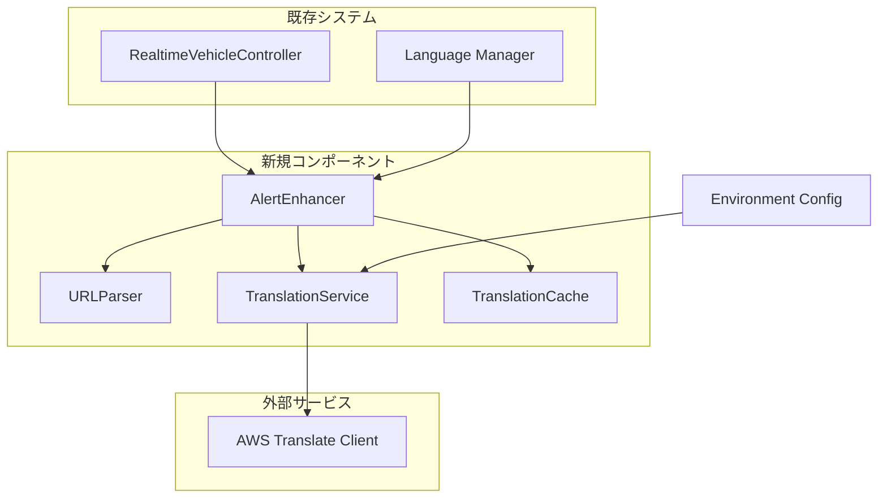
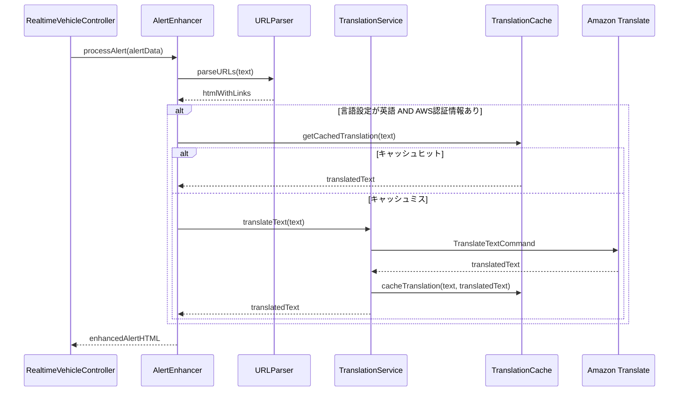

# 設計文書

## 概要

佐賀バスナビゲーターアプリのお知らせ機能を改善し、URLのハイパーリンク化とAmazon Translateを使用した多言語対応を実装する。既存のRealtimeVehicleControllerのお知らせ表示機能を拡張し、新しいコンポーネントを追加する。

## アーキテクチャ

### システム構成図



### データフロー



## コンポーネントと インターフェース

### AlertEnhancer

お知らせ機能の拡張を統括するメインコンポーネント。

```javascript
class AlertEnhancer {
  constructor(translationService, urlParser, languageManager)
  
  // メインの処理メソッド
  async processAlert(alertData, options = {})
  
  // 言語設定変更時の処理
  onLanguageChange(newLanguage)
  
  // 設定確認
  isTranslationEnabled()
}
```

### URLParser

テキスト内のURLを検出してハイパーリンク化する。

```javascript
class URLParser {
  // URL検出とハイパーリンク化
  parseURLs(text)
  
  // URLパターンの正規表現
  static URL_REGEX = /https?:\/\/[^\s<>"{}|\\^`[\]]+/gi
  
  // セキュリティ属性の設定
  createSecureLink(url, text)
}
```

### TranslationService

Amazon Translateとの連携を管理する。

```javascript
class TranslationService {
  constructor(config = {})
  
  // 翻訳実行
  async translateText(text, sourceLanguage = 'ja', targetLanguage = 'en')
  
  // 認証情報の確認
  isConfigured()
  
  // AWS Translateクライアントの初期化
  initializeClient()
  
  // エラーハンドリング
  handleTranslationError(error)
}
```

### TranslationCache

翻訳結果のキャッシュ管理。

```javascript
class TranslationCache {
  constructor(maxSize = 100, ttl = 24 * 60 * 60 * 1000) // 24時間
  
  // キャッシュから取得
  get(key)
  
  // キャッシュに保存
  set(key, value)
  
  // キャッシュクリア
  clear()
  
  // 古いエントリの削除
  cleanup()
}
```

## データモデル

### AlertData

```javascript
interface AlertData {
  id: string
  headerText?: string
  descriptionText?: string
  activeStart?: number
  activeEnd?: number
  url?: string
}
```

### EnhancedAlert

```javascript
interface EnhancedAlert extends AlertData {
  processedHeaderText: string
  processedDescriptionText: string
  translatedHeaderText?: string
  translatedDescriptionText?: string
  hasTranslation: boolean
  isLoading: boolean
}
```

### TranslationCacheEntry

```javascript
interface TranslationCacheEntry {
  originalText: string
  translatedText: string
  timestamp: number
  sourceLanguage: string
  targetLanguage: string
}
```

## 正確性プロパティ

*プロパティとは、システムの全ての有効な実行において成り立つべき特性や動作の形式的な記述です。これらのプロパティは、人間が読める仕様と機械で検証可能な正確性保証の橋渡しとなります。*

### プロパティ1: URL検出と変換の完全性
*任意の* テキストに対して、HTTP・HTTPSプロトコルのURLが含まれている場合、URLParserは全てのURLを検出してセキュリティ属性付きのハイパーリンクに変換する
**検証: 要件 1.1, 1.2, 1.3, 1.4, 1.5**

### プロパティ2: 翻訳機能の認証情報依存制御
*任意の* システム状態において、AWS認証情報が設定されている場合のみ翻訳機能が有効化され、設定されていない場合は日本語テキストが表示される
**検証: 要件 2.2, 3.2**

### プロパティ3: 言語設定による表示切り替え
*任意の* 言語設定と認証情報の組み合わせに対して、AlertEnhancerは適切な言語のテキストを表示する（英語設定+認証情報ありは翻訳、その他は日本語原文）
**検証: 要件 3.1, 3.2, 3.3, 3.4**

### プロパティ4: 翻訳キャッシュの利用と一意性
*任意の* 同一テキストに対する翻訳要求において、TranslationServiceはキャッシュから結果を返し、各テキストと言語ペアの組み合わせに対して最大1つのエントリのみを保持する
**検証: 要件 2.5, 4.2**

### プロパティ5: エラー時のフォールバック動作
*任意の* 翻訳エラー（API エラー、ネットワークエラー、タイムアウト）が発生した場合、TranslationServiceは元の日本語テキストを返し、基本機能を継続する
**検証: 要件 2.6, 5.1, 5.2, 5.4, 5.5**

### プロパティ6: キャッシュサイズと有効期限の管理
*任意の* 時点において、TranslationCacheのエントリ数は最大100個を超えず、24時間を超えた古いエントリは削除される
**検証: 要件 4.3, 4.4, 4.5**

### プロパティ7: 非同期処理中のUI継続性
*任意の* 翻訳処理中において、AlertSystemは元のテキストを即座に表示し、翻訳完了後にUIを更新する
**検証: 要件 6.1, 6.2, 6.3**

## エラーハンドリング

### 翻訳エラー

1. **ネットワークエラー**: 元のテキストを表示し、エラーをログに記録
2. **認証エラー**: 翻訳機能を無効化し、日本語テキストを表示
3. **タイムアウト**: 5秒後に処理を中断し、元のテキストを表示
4. **APIエラー**: エラー内容をログに記録し、元のテキストを表示

### URL解析エラー

1. **不正なURL**: 該当URLをスキップし、他のURLは正常に処理
2. **正規表現エラー**: 元のテキストをそのまま返す

### キャッシュエラー

1. **ストレージ容量不足**: 古いエントリを削除して新しいエントリを保存
2. **データ破損**: 該当エントリを削除し、新しい翻訳を実行

## テスト戦略

### 単体テスト

- URLParser: 各種URL形式の検出テスト
- TranslationService: AWS SDK呼び出しのモックテスト
- TranslationCache: キャッシュ操作の基本機能テスト
- AlertEnhancer: 統合処理のテスト

### プロパティベーステスト

各正確性プロパティに対して、最低100回の反復テストを実行：

- **プロパティ1**: ランダムなテキストとURL組み合わせでURL検出とセキュリティ属性設定をテスト
- **プロパティ2**: 様々な認証情報設定状態で翻訳機能の有効/無効制御を検証
- **プロパティ3**: 言語設定と認証情報の全組み合わせで表示切り替えを検証
- **プロパティ4**: ランダムなテキストでキャッシュ利用と一意性を検証
- **プロパティ5**: 様々なエラー条件でフォールバック動作を検証
- **プロパティ6**: キャッシュサイズ制限と有効期限管理を検証
- **プロパティ7**: 非同期処理中のUI状態を検証

### 統合テスト

- RealtimeVehicleControllerとの連携テスト
- 実際のお知らせデータを使用したエンドツーエンドテスト
- 言語切り替え時の動作テスト

### パフォーマンステスト

- URL解析処理時間（100ms以内）
- 翻訳キャッシュアクセス時間
- 大量のお知らせデータでの処理性能