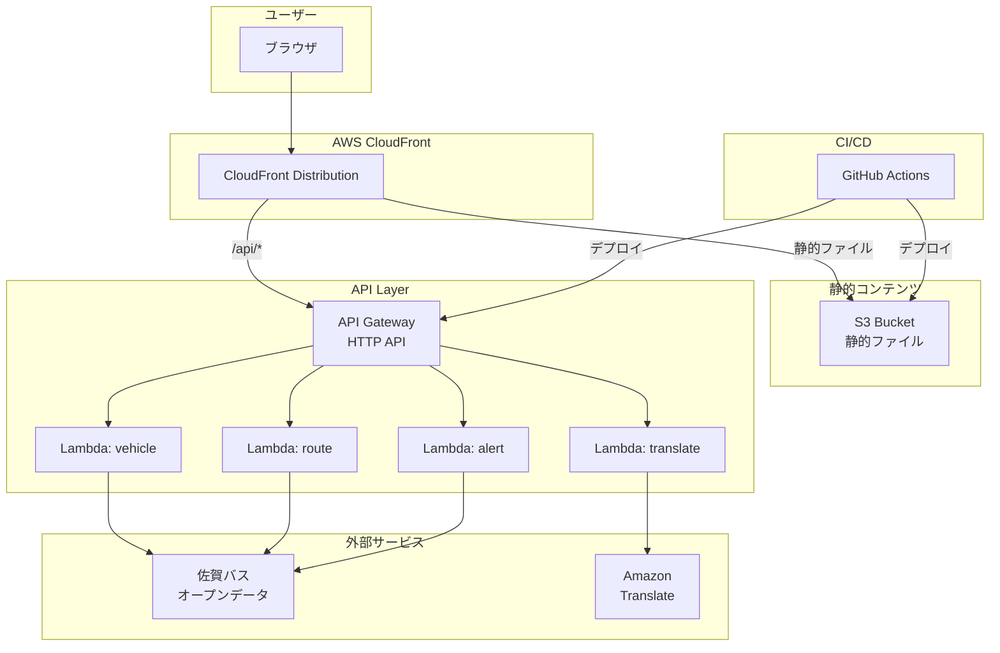
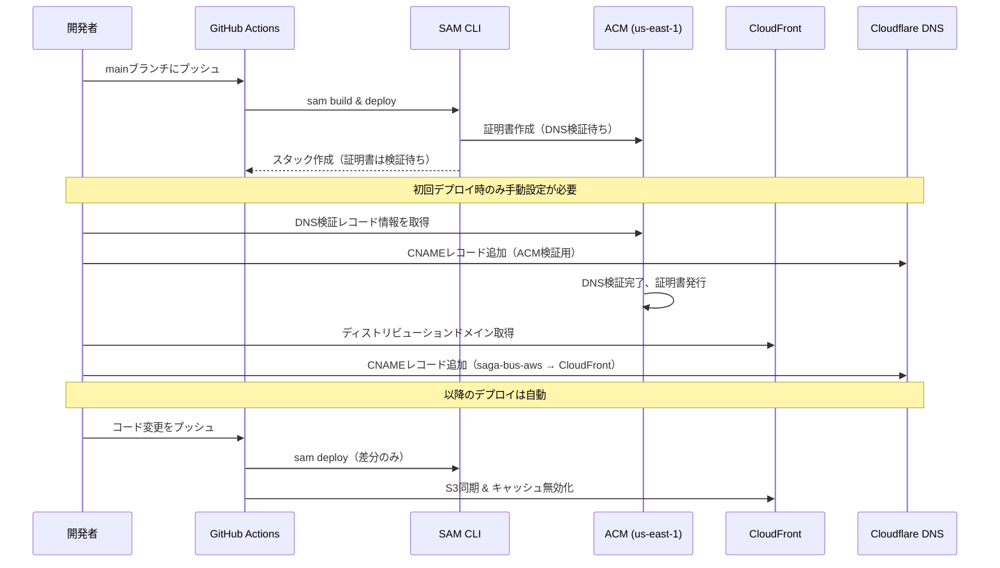

# Design Document

## Overview

Cloudflare Pages/FunctionsからAWS無料枠への移行設計。S3+CloudFrontで静的ホスティング、Lambda+API Gateway (HTTP API)でサーバーレスAPI、GitHub ActionsでCI/CDを実現する。

## Architecture



## Components and Interfaces

### 1. ACM Certificate

CloudFrontでHTTPSを使用するため、us-east-1リージョンにワイルドカード証明書を作成する。

```typescript
interface ACMCertificateConfig {
  domainName: '*.midnight480.com';
  subjectAlternativeNames: ['midnight480.com'];  // ルートドメインも含める
  validationMethod: 'DNS';
  region: 'us-east-1';  // CloudFront要件
}
```

### 2. CloudFront Distribution

CloudFrontは単一のエントリーポイントとして機能し、リクエストパスに基づいてS3またはAPI Gatewayにルーティングする。

```typescript
// CloudFront Behavior設定
interface CloudFrontConfig {
  aliases: ['saga-bus-aws.midnight480.com'];
  viewerCertificate: {
    acmCertificateArn: string;  // ACM証明書ARN
    sslSupportMethod: 'sni-only';
    minimumProtocolVersion: 'TLSv1.2_2021';
  };
  origins: {
    s3: {
      domainName: string;  // S3バケットのリージョナルドメイン
      originAccessControl: string;  // OAC ID
    };
    apiGateway: {
      domainName: string;  // API Gateway URL
      customHeaders: Record<string, string>;
    };
  };
  behaviors: {
    default: {
      origin: 's3';
      cachePolicyId: string;  // CachingOptimized
      viewerProtocolPolicy: 'redirect-to-https';
    };
    api: {
      pathPattern: '/api/*';
      origin: 'apiGateway';
      cachePolicyId: string;  // CachingDisabled or Custom 30s
      allowedMethods: ['GET', 'POST', 'OPTIONS'];
    };
  };
}
```

### 2. S3 Bucket

静的ファイルを保存するバケット。パブリックアクセスは完全にブロックし、CloudFrontからのみアクセス可能。

```typescript
interface S3BucketConfig {
  bucketName: string;
  blockPublicAccess: {
    blockPublicAcls: true;
    blockPublicPolicy: true;
    ignorePublicAcls: true;
    restrictPublicBuckets: true;
  };
  websiteConfiguration: null;  // 静的ウェブサイトホスティングは使用しない
}
```

### 3. API Gateway (HTTP API)

REST APIより安価なHTTP APIを使用。Lambda統合でプロキシ関数を呼び出す。

```typescript
interface APIGatewayConfig {
  apiType: 'HTTP';
  routes: {
    'GET /api/vehicle': 'vehicleFunction';
    'OPTIONS /api/vehicle': 'vehicleFunction';
    'GET /api/route': 'routeFunction';
    'OPTIONS /api/route': 'routeFunction';
    'GET /api/alert': 'alertFunction';
    'OPTIONS /api/alert': 'alertFunction';
    'POST /api/translate': 'translateFunction';
    'OPTIONS /api/translate': 'translateFunction';
  };
  corsConfiguration: {
    allowOrigins: ['https://saga-bus-aws.midnight480.com'];
    allowMethods: ['GET', 'POST', 'OPTIONS'];
    allowHeaders: ['Content-Type'];
    maxAge: 600;
  };
}
```

### 4. Lambda Functions

Node.js 20.xランタイム、128MBメモリで動作するサーバーレス関数。

```typescript
// Lambda関数の共通インターフェース
interface LambdaEvent {
  httpMethod: string;
  path: string;
  headers: Record<string, string>;
  body?: string;
  isBase64Encoded: boolean;
}

interface LambdaResponse {
  statusCode: number;
  headers: Record<string, string>;
  body: string;
  isBase64Encoded?: boolean;
}

// プロキシ関数の設定
interface ProxyFunctionConfig {
  runtime: 'nodejs20.x';
  memorySize: 128;
  timeout: 10;
  environment: {
    UPSTREAM_URL: string;
    ALLOWED_ORIGIN: string;
  };
}

// 翻訳関数の設定
interface TranslateFunctionConfig {
  runtime: 'nodejs20.x';
  memorySize: 128;
  timeout: 15;
  environment: {
    AWS_REGION: string;
  };
  // IAMロールにtranslate:TranslateText権限を付与
}
```

### 5. GitHub Actions Workflow

mainブランチへのプッシュでトリガーされるCI/CDパイプライン。

```typescript
interface GitHubActionsWorkflow {
  trigger: {
    push: { branches: ['main'] };
    pull_request: { branches: ['main'] };
  };
  jobs: {
    test: {
      steps: ['checkout', 'setup-node', 'install', 'test'];
    };
    deploy: {
      needs: ['test'];
      condition: "github.ref == 'refs/heads/main'";
      steps: [
        'checkout',
        'setup-node',
        'setup-sam',
        'configure-aws-credentials',
        'sam-build',
        'sam-deploy',
        'sync-s3',
        'invalidate-cloudfront'
      ];
    };
  };
  secrets: {
    AWS_ACCESS_KEY_ID: string;
    AWS_SECRET_ACCESS_KEY: string;
    AWS_REGION: string;
    CLOUDFRONT_DISTRIBUTION_ID: string;
  };
}
```

## Data Models

### Lambda Event/Response (API Gateway HTTP API形式)

```typescript
// API Gateway HTTP API v2 イベント形式
interface APIGatewayProxyEventV2 {
  version: '2.0';
  routeKey: string;
  rawPath: string;
  rawQueryString: string;
  headers: Record<string, string>;
  requestContext: {
    http: {
      method: string;
      path: string;
    };
  };
  body?: string;
  isBase64Encoded: boolean;
}

// レスポンス形式
interface APIGatewayProxyResultV2 {
  statusCode: number;
  headers?: Record<string, string>;
  body?: string;
  isBase64Encoded?: boolean;
}
```

### SAM Template構造

```yaml
# template.yaml の構造
AWSTemplateFormatVersion: '2010-09-09'
Transform: AWS::Serverless-2016-10-31

Globals:
  Function:
    Runtime: nodejs20.x
    MemorySize: 128
    Timeout: 10

Resources:
  # ACM Certificate (us-east-1 required for CloudFront)
  Certificate:
    Type: AWS::CertificateManager::Certificate
    Properties:
      DomainName: '*.midnight480.com'
      SubjectAlternativeNames:
        - midnight480.com
      ValidationMethod: DNS
      # Note: us-east-1にデプロイする必要あり
  
  # S3 Bucket
  StaticBucket:
    Type: AWS::S3::Bucket
  
  # CloudFront OAC
  CloudFrontOAC:
    Type: AWS::CloudFront::OriginAccessControl
  
  # CloudFront Distribution
  Distribution:
    Type: AWS::CloudFront::Distribution
  
  # API Gateway HTTP API
  HttpApi:
    Type: AWS::Serverless::HttpApi
  
  # Lambda Functions
  VehicleFunction:
    Type: AWS::Serverless::Function
  RouteFunction:
    Type: AWS::Serverless::Function
  AlertFunction:
    Type: AWS::Serverless::Function
  TranslateFunction:
    Type: AWS::Serverless::Function

Outputs:
  CloudFrontDomain:
    Description: CloudFrontディストリビューションのドメイン名（DNS設定用）
    Value: !GetAtt Distribution.DomainName
  CloudFrontDistributionId:
    Description: CloudFrontディストリビューションID（キャッシュ無効化用）
    Value: !Ref Distribution
  CertificateArn:
    Description: ACM証明書ARN
    Value: !Ref Certificate
  ApiEndpoint:
    Value: !Sub "https://${HttpApi}.execute-api.${AWS::Region}.amazonaws.com"
```


## Correctness Properties

*A property is a characteristic or behavior that should hold true across all valid executions of a system-essentially, a formal statement about what the system should do. Properties serve as the bridge between human-readable specifications and machine-verifiable correctness guarantees.*

### Property 1: CORSヘッダー付与

*For any* プロキシLambda関数へのリクエスト, レスポンスには必ず `Access-Control-Allow-Origin` ヘッダーが含まれる

**Validates: Requirements 2.4**

### Property 2: OPTIONSプリフライト応答

*For any* APIエンドポイントへのOPTIONSリクエスト, レスポンスはステータス204と適切なCORSヘッダー（Allow-Methods, Allow-Headers, Max-Age）を含む

**Validates: Requirements 4.5**

### Property 3: 翻訳レスポンス形式

*For any* 有効なテキストを含む翻訳リクエスト, レスポンスは `translatedText`, `sourceLanguage`, `targetLanguage` フィールドを含むJSONオブジェクトである

**Validates: Requirements 3.2**

## Error Handling

### デプロイフロー（DNS設定含む）



### Lambda関数のエラーハンドリング

```typescript
// プロキシ関数のエラーハンドリング
async function handleProxyError(error: Error): Promise<APIGatewayProxyResultV2> {
  console.error('Proxy error:', error);
  
  return {
    statusCode: 502,
    headers: {
      'Content-Type': 'text/plain; charset=utf-8',
      'Access-Control-Allow-Origin': ALLOWED_ORIGIN,
    },
    body: `Proxy error: ${error.message}`,
  };
}

// 翻訳関数のエラーハンドリング
function handleTranslateError(error: Error): APIGatewayProxyResultV2 {
  const errorMap: Record<string, { code: string; status: number }> = {
    'UnrecognizedClientException': { code: 'AUTH_ERROR', status: 401 },
    'AccessDeniedException': { code: 'AUTH_ERROR', status: 401 },
    'ThrottlingException': { code: 'RATE_LIMIT', status: 429 },
    'TextSizeLimitExceededException': { code: 'TEXT_TOO_LONG', status: 400 },
    'UnsupportedLanguagePairException': { code: 'UNSUPPORTED_LANGUAGE', status: 400 },
  };
  
  const mapped = errorMap[error.name] || { code: 'TRANSLATION_ERROR', status: 500 };
  
  return {
    statusCode: mapped.status,
    headers: { 'Content-Type': 'application/json', ...CORS_HEADERS },
    body: JSON.stringify({ error: error.message, code: mapped.code }),
  };
}
```

### CI/CDパイプラインのエラーハンドリング

- テスト失敗時: デプロイジョブをスキップ
- SAMビルド失敗時: ワークフロー全体を失敗として終了
- S3同期失敗時: CloudFront無効化をスキップし、ワークフローを失敗として終了

## Testing Strategy

### 単体テスト（Vitest）

Lambda関数のビジネスロジックをテスト：

```typescript
// tests/lambda/proxy.test.ts
describe('Proxy Lambda', () => {
  it('should add CORS headers to response', async () => {
    // Property 1の検証
  });
  
  it('should return 502 on upstream error', async () => {
    // Requirement 2.6の検証
  });
});

// tests/lambda/translate.test.ts
describe('Translate Lambda', () => {
  it('should return JSON with required fields', async () => {
    // Property 3の検証
  });
  
  it('should return original text for whitespace-only input', async () => {
    // Requirement 3.3の検証
  });
});
```

### Property-Based Tests（fast-check）

```typescript
// tests/lambda/proxy.property.test.ts
import fc from 'fast-check';

describe('Proxy Lambda Properties', () => {
  // Property 1: CORSヘッダー付与
  it('should always include CORS headers', () => {
    fc.assert(
      fc.property(fc.string(), async (path) => {
        const response = await handler(mockEvent(path));
        expect(response.headers).toHaveProperty('Access-Control-Allow-Origin');
      })
    );
  });
});

// tests/lambda/translate.property.test.ts
describe('Translate Lambda Properties', () => {
  // Property 3: 翻訳レスポンス形式
  it('should return valid JSON structure for any text', () => {
    fc.assert(
      fc.property(fc.string().filter(s => s.trim().length > 0), async (text) => {
        const response = await handler(mockTranslateEvent(text));
        const body = JSON.parse(response.body);
        expect(body).toHaveProperty('translatedText');
        expect(body).toHaveProperty('sourceLanguage');
        expect(body).toHaveProperty('targetLanguage');
      })
    );
  });
});
```

### 統合テスト

デプロイ後のエンドポイント検証：

```bash
# 静的ファイル配信確認
curl -I https://saga-bus-aws.midnight480.com/

# APIエンドポイント確認
curl https://saga-bus-aws.midnight480.com/api/vehicle
curl https://saga-bus-aws.midnight480.com/api/route
curl https://saga-bus-aws.midnight480.com/api/alert

# CORSプリフライト確認
curl -X OPTIONS https://saga-bus-aws.midnight480.com/api/vehicle \
  -H "Origin: https://saga-bus-aws.midnight480.com"
```

### IaCテンプレート検証

```bash
# SAMテンプレートの構文検証
sam validate --lint

# CloudFormation変更セットのプレビュー
sam deploy --no-execute-changeset
```
