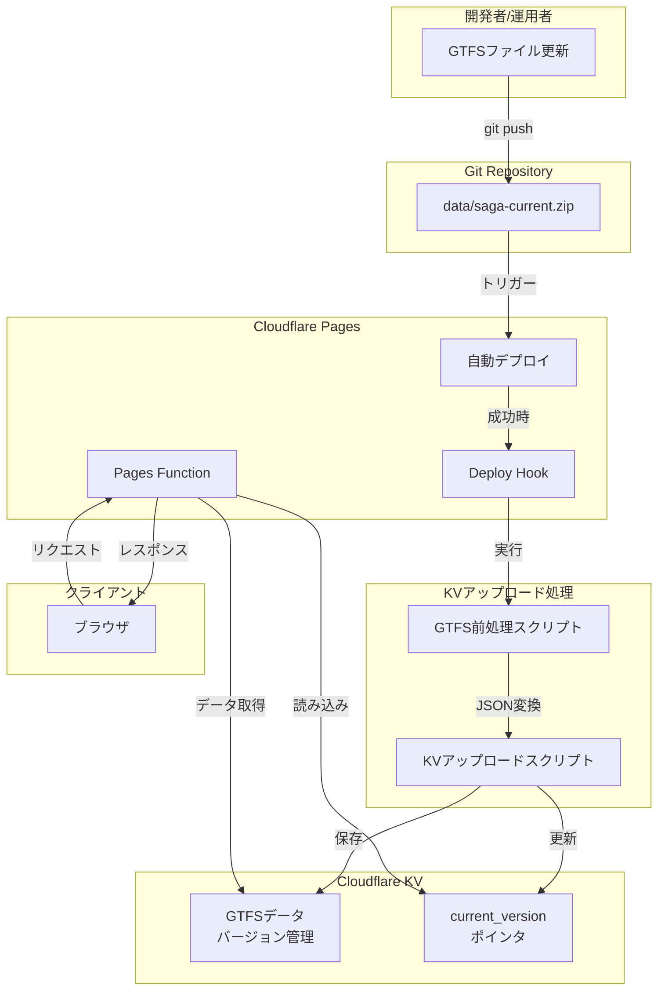

# 設計書

## 概要

本設計書は、佐賀バスナビゲーターにおけるCloudflare KVを使用したGTFSデータ管理機能の詳細設計を定義します。現在のZIPファイル直接読み込み方式から、KVを使用した高速アクセス方式に移行することで、Pages FunctionのCPU時間制限（50ms）内での処理を実現します。

## アーキテクチャ

### システム構成図



### データフロー

1. **データ更新フロー**
   - 運用者がdata/saga-current.zipを更新してGitにプッシュ
   - Cloudflare Pagesが自動デプロイを実行
   - デプロイ成功後、Deploy Hookが前処理スクリプトを起動
   - 前処理スクリプトがGTFS ZIPをJSON形式に変換
   - KVアップロードスクリプトがJSONデータをKVに保存
   - バージョン管理により2世代以前のデータを自動削除

2. **データ読み込みフロー**
   - Pages Functionが起動
   - DataLoaderがKVから`gtfs:current_version`を読み込み
   - 現在のバージョン番号を使用して各GTFSテーブルをKVから読み込み
   - データをメモリにキャッシュ
   - 以降のリクエストはメモリキャッシュから返す

3. **フォールバックフロー**
   - KVからの読み込みが失敗した場合
   - DataLoaderが自動的にZIPファイル読み込みに切り替え
   - 既存の処理フローで継続

## コンポーネントと インターフェース

### 1. GTFS前処理スクリプト (scripts/gtfs_to_json.js)

**責務**: GTFS ZIPファイルをJSON形式に変換する

**入力**:
- GTFSファイルパス: `data/saga-current.zip`

**出力**:
- JSONファイル群: `./gtfs-json/` ディレクトリ
  - `stops.json`
  - `stop_times.json` (または分割された `stop_times_0.json`, `stop_times_1.json`, ...)
  - `routes.json`
  - `trips.json`
  - `calendar.json`
  - `agency.json`
  - `fare_attributes.json`

**主要機能**:
```javascript
// 疑似コード
class GTFSPreprocessor {
  constructor(zipPath) {
    this.zipPath = zipPath;
    this.outputDir = './gtfs-json';
  }

  async process() {
    // ZIPファイルを読み込み
    const zip = await this.loadZip();
    
    // 各GTFSファイルを処理
    const tables = ['stops', 'stop_times', 'routes', 'trips', 'calendar', 'agency', 'fare_attributes'];
    
    for (const table of tables) {
      const csvData = await zip.file(`${table}.txt`).async('string');
      const jsonData = this.csvToJson(csvData);
      
      // stop_timesは25MB超の場合に分割
      if (table === 'stop_times' && this.getSize(jsonData) > 25 * 1024 * 1024) {
        await this.splitAndSave(table, jsonData);
      } else {
        await this.saveJson(table, jsonData);
      }
    }
  }

  csvToJson(csvData) {
    // CSVをパースしてJSON配列に変換
    // ヘッダー行をキーとして使用
  }

  splitAndSave(table, jsonData) {
    // 25MB以下のチャンクに分割して保存
    const chunkSize = 20 * 1024 * 1024; // 20MBを目安
    const chunks = this.splitIntoChunks(jsonData, chunkSize);
    
    for (let i = 0; i < chunks.length; i++) {
      this.saveJson(`${table}_${i}`, chunks[i]);
    }
  }

  saveJson(name, data) {
    // JSONファイルとして保存
  }
}
```

### 2. KVアップロードスクリプト (scripts/upload_to_kv.js)

**責務**: JSONファイルをCloudflare KVに保存し、バージョン管理を行う

**入力**:
- JSONファイル群: `./gtfs-json/` ディレクトリ
- 環境変数:
  - `CLOUDFLARE_ACCOUNT_ID`: CloudflareアカウントID
  - `CLOUDFLARE_API_TOKEN`: Cloudflare API Token
  - `KV_NAMESPACE_ID`: KV Namespace ID

**出力**:
- KVに保存されたデータ
- バージョン情報のログ

**主要機能**:
```javascript
// 疑似コード
class KVUploader {
  constructor(accountId, apiToken, namespaceId) {
    this.accountId = accountId;
    this.apiToken = apiToken;
    this.namespaceId = namespaceId;
    this.baseUrl = `https://api.cloudflare.com/client/v4/accounts/${accountId}/storage/kv/namespaces/${namespaceId}`;
  }

  async upload(jsonDir) {
    // バージョン番号を生成（タイムスタンプ）
    const version = this.generateVersion(); // YYYYMMDDHHmmss
    
    // JSONファイルを読み込んでKVに保存
    const files = await this.listJsonFiles(jsonDir);
    
    for (const file of files) {
      const data = await this.readJsonFile(file);
      const key = this.generateKey(version, file);
      await this.putKV(key, data);
    }
    
    // current_versionを更新
    await this.putKV('gtfs:current_version', version);
    
    // 古いバージョンを削除（2世代以前）
    await this.cleanupOldVersions(version);
  }

  generateVersion() {
    // 現在時刻からバージョン番号を生成
    const now = new Date();
    return now.toISOString()
      .replace(/[-:T]/g, '')
      .slice(0, 14); // YYYYMMDDHHmmss
  }

  generateKey(version, filename) {
    // ファイル名からテーブル名を抽出
    const tableName = filename.replace('.json', '');
    return `gtfs:v${version}:${tableName}`;
  }

  async putKV(key, value) {
    // Cloudflare KV APIを使用してデータを保存
    const response = await fetch(`${this.baseUrl}/values/${key}`, {
      method: 'PUT',
      headers: {
        'Authorization': `Bearer ${this.apiToken}`,
        'Content-Type': 'application/json'
      },
      body: JSON.stringify(value)
    });
    
    if (!response.ok) {
      throw new Error(`KV PUT failed: ${response.status} ${response.statusText}`);
    }
  }

  async cleanupOldVersions(currentVersion) {
    // KVから全てのバージョンをリストアップ
    const versions = await this.listVersions();
    
    // タイムスタンプで降順ソート
    versions.sort((a, b) => b.localeCompare(a));
    
    // 最新2世代以外を削除
    const versionsToDelete = versions.slice(2);
    
    for (const version of versionsToDelete) {
      await this.deleteVersion(version);
    }
  }

  async listVersions() {
    // KVから全てのキーをリストアップし、バージョン番号を抽出
    const response = await fetch(`${this.baseUrl}/keys?prefix=gtfs:v`, {
      headers: {
        'Authorization': `Bearer ${this.apiToken}`
      }
    });
    
    const data = await response.json();
    const versions = new Set();
    
    for (const key of data.result) {
      const match = key.name.match(/^gtfs:v(\d{14}):/);
      if (match) {
        versions.add(match[1]);
      }
    }
    
    return Array.from(versions);
  }

  async deleteVersion(version) {
    // 指定されたバージョンの全てのキーを削除
    const keys = await this.listKeysForVersion(version);
    
    for (const key of keys) {
      await this.deleteKV(key);
    }
  }

  async deleteKV(key) {
    // Cloudflare KV APIを使用してキーを削除
    await fetch(`${this.baseUrl}/values/${key}`, {
      method: 'DELETE',
      headers: {
        'Authorization': `Bearer ${this.apiToken}`
      }
    });
  }
}
```

### 3. Deploy Hook統合 (functions/deploy-hook.js)

**責務**: Pagesデプロイ完了後にKVアップロード処理を実行する

**トリガー**: Cloudflare Pages Deploy Hook

**処理フロー**:
```javascript
// 疑似コード
export async function onRequest(context) {
  const { request, env } = context;
  
  // Deploy Hookからのリクエストを検証
  if (request.method !== 'POST') {
    return new Response('Method not allowed', { status: 405 });
  }
  
  try {
    // GTFS前処理を実行
    const preprocessor = new GTFSPreprocessor('data/saga-current.zip');
    await preprocessor.process();
    
    // KVアップロードを実行
    const uploader = new KVUploader(
      env.CLOUDFLARE_ACCOUNT_ID,
      env.CLOUDFLARE_API_TOKEN,
      env.KV_NAMESPACE_ID
    );
    await uploader.upload('./gtfs-json');
    
    return new Response(JSON.stringify({
      success: true,
      message: 'GTFS data uploaded to KV successfully'
    }), {
      headers: { 'Content-Type': 'application/json' }
    });
  } catch (error) {
    console.error('Deploy hook error:', error);
    return new Response(JSON.stringify({
      success: false,
      error: error.message
    }), {
      status: 500,
      headers: { 'Content-Type': 'application/json' }
    });
  }
}
```

### 4. DataLoader KV統合 (js/data-loader.js)

**責務**: KVからGTFSデータを読み込み、メモリキャッシュを管理する

**既存機能との互換性**: 既存のDataLoader APIを維持しつつ、内部実装をKV対応に変更

**主要機能**:
```javascript
// 疑似コード
class DataLoader {
  constructor() {
    this.cache = null;
    this.kvNamespace = null; // Pages Functionから渡される
  }

  // KV Namespaceを設定（Pages Functionから呼び出される）
  setKVNamespace(kvNamespace) {
    this.kvNamespace = kvNamespace;
  }

  async loadData() {
    // キャッシュがあれば返す
    if (this.cache) {
      return this.cache;
    }

    try {
      // KVから読み込みを試行
      if (this.kvNamespace) {
        this.cache = await this.loadFromKV();
        return this.cache;
      }
    } catch (error) {
      console.warn('KV load failed, falling back to ZIP:', error);
    }

    // フォールバック: ZIPファイルから読み込み
    this.cache = await this.loadFromZip();
    return this.cache;
  }

  async loadFromKV() {
    // 現在のバージョンを取得
    const version = await this.kvNamespace.get('gtfs:current_version', 'text');
    
    if (!version) {
      throw new Error('No current version found in KV');
    }

    // 各テーブルを並列に読み込み
    const tables = ['stops', 'routes', 'trips', 'calendar', 'agency', 'fare_attributes'];
    const promises = tables.map(table => 
      this.loadTableFromKV(version, table)
    );

    // stop_timesは分割されている可能性があるため特別処理
    promises.push(this.loadStopTimesFromKV(version));

    const results = await Promise.all(promises);

    // 結果をオブジェクトにまとめる
    const data = {};
    for (let i = 0; i < tables.length; i++) {
      data[tables[i]] = results[i];
    }
    data.stop_times = results[results.length - 1];

    // 既存アプリケーション形式に変換
    return this.convertToAppFormat(data);
  }

  async loadTableFromKV(version, table) {
    const key = `gtfs:v${version}:${table}`;
    const data = await this.kvNamespace.get(key, 'json');
    
    if (!data) {
      throw new Error(`Table ${table} not found in KV`);
    }
    
    return data;
  }

  async loadStopTimesFromKV(version) {
    // まず分割されていないキーを試す
    try {
      return await this.loadTableFromKV(version, 'stop_times');
    } catch (error) {
      // 分割されている場合は全てのチャンクを読み込んで結合
      const chunks = [];
      let chunkIndex = 0;
      
      while (true) {
        try {
          const key = `gtfs:v${version}:stop_times_${chunkIndex}`;
          const chunk = await this.kvNamespace.get(key, 'json');
          
          if (!chunk) break;
          
          chunks.push(chunk);
          chunkIndex++;
        } catch (error) {
          break;
        }
      }
      
      if (chunks.length === 0) {
        throw new Error('No stop_times data found in KV');
      }
      
      // チャンクを結合
      return chunks.flat();
    }
  }

  async loadFromZip() {
    // 既存のZIPファイル読み込み処理
    // （既存コードを維持）
  }

  convertToAppFormat(gtfsData) {
    // GTFSデータを既存アプリケーション形式に変換
    // （既存の変換ロジックを使用）
  }

  clearCache() {
    this.cache = null;
  }
}
```

## データモデル

### KVキー構造

```
gtfs:current_version
  → 値: "20250115143045" (現在有効なバージョン番号)

gtfs:v20250115143045:stops
  → 値: JSON配列（バス停データ）

gtfs:v20250115143045:stop_times
  → 値: JSON配列（時刻表データ、25MB以下の場合）

gtfs:v20250115143045:stop_times_0
gtfs:v20250115143045:stop_times_1
  → 値: JSON配列（時刻表データ、25MB超で分割された場合）

gtfs:v20250115143045:routes
  → 値: JSON配列（路線データ）

gtfs:v20250115143045:trips
  → 値: JSON配列（便データ）

gtfs:v20250115143045:calendar
  → 値: JSON配列（運行カレンダーデータ）

gtfs:v20250115143045:agency
  → 値: JSON配列（事業者データ）

gtfs:v20250115143045:fare_attributes
  → 値: JSON配列（運賃データ）
```

### バージョン管理

- **バージョン番号形式**: `YYYYMMDDHHmmss` (例: `20250115143045`)
- **世代管理**: 最新2世代のみを保持
  - 当世代: 現在有効なバージョン
  - 1世代前: ロールバック用
  - 2世代以前: 自動削除

### データサイズ制約

- **KV値サイズ上限**: 25MB
- **stop_times分割基準**: 20MBを超える場合に分割
- **分割チャンクサイズ**: 20MB以下

## 正確性プロパティ

*プロパティとは、システムの全ての有効な実行において真であるべき特性や振る舞いのことです。プロパティは人間が読める仕様と機械で検証可能な正確性保証の橋渡しとなります。*


### プロパティ1: GTFS ZIPからJSONへの変換ラウンドトリップ

*任意の*有効なGTFS ZIPファイルに対して、ZIPファイルを解凍してJSON形式に変換し、そのJSONを再度GTFS形式に戻した場合、元のデータと等価なデータが得られる

**検証: 要件 1.1, 1.2, 1.4**

### プロパティ2: 大容量データの自動分割

*任意の*25MBを超えるstop_timesデータに対して、分割処理を実行した場合、全てのチャンクのサイズが25MB以下であり、かつ全てのチャンクを結合すると元のデータと等価なデータが得られる

**検証: 要件 1.3**

### プロパティ3: エラー時の処理中断とログ出力

*任意の*不正なGTFSデータに対して、変換処理を実行した場合、エラーが発生し、詳細なエラーメッセージがログに出力され、処理が中断される

**検証: 要件 1.5**

### プロパティ4: バージョン番号の形式

*任意の*アップロード処理に対して、生成されるバージョン番号はYYYYMMDDHHmmss形式（14桁の数字）である

**検証: 要件 2.1**

### プロパティ5: KVへのデータ保存とキー形式

*任意の*GTFSテーブルデータに対して、KVに保存する場合、キー形式は`gtfs:v{version}:{table_name}`または`gtfs:v{version}:{table_name}_{chunk_index}`であり、保存後にKVから読み込んだデータは元のデータと等価である

**検証: 要件 2.2, 2.3, 2.4**

### プロパティ6: KV保存エラー時のクリーンアップ

*任意の*KV保存処理に対して、保存中にエラーが発生した場合、部分的に保存されたデータがクリーンアップされ、エラーが報告される

**検証: 要件 2.6**

### プロパティ7: DataLoaderのKVからのデータ読み込み

*任意の*DataLoader初期化に対して、KVから`gtfs:current_version`を取得し、そのバージョンの全てのGTFSテーブルを読み込んだ場合、読み込まれたデータは元のGTFSデータと等価である

**検証: 要件 4.1, 4.2**

### プロパティ8: 分割データの読み込みと結合

*任意の*分割されたstop_timesデータに対して、全てのチャンクを並列に読み込んで結合した場合、結合後のデータは元のstop_timesデータと等価である

**検証: 要件 4.3**

### プロパティ9: メモリキャッシュの動作

*任意の*DataLoaderインスタンスに対して、初回のデータ読み込み後、2回目以降のリクエストはKVにアクセスせずにメモリキャッシュから返される。また、clearCache()を呼び出した後の次回リクエストはKVから再読み込みされる

**検証: 要件 4.4, 4.6**

### プロパティ10: KV読み込み失敗時のフォールバック

*任意の*DataLoader初期化に対して、KVからのデータ読み込みが失敗した場合（接続失敗またはタイムアウト）、システムは自動的にZIPファイルから読み込み、フォールバックが発生したことをログに記録し、アプリケーションは正常に動作する

**検証: 要件 4.5, 6.1, 6.2, 6.3, 6.4**

### プロパティ11: バージョンライフサイクル管理

*任意の*KVアップロード処理に対して、新しいバージョンをアップロードした後、KVには最大2世代のバージョンのみが保持され、2世代以前のバージョンは自動的に削除される

**検証: 要件 5.1, 5.2, 5.3**

### プロパティ12: ロールバック機能

*任意の*ロールバックコマンド実行に対して、1世代前のバージョンが存在する場合、`gtfs:current_version`が1世代前のバージョン番号に更新され、次回のDataLoader初期化時から1世代前のバージョンのデータが使用される

**検証: 要件 5.4, 5.5, 5.6**

## エラーハンドリング

### エラーカテゴリ

1. **データ変換エラー**
   - 不正なGTFS形式
   - CSVパースエラー
   - JSON変換エラー
   - 対応: エラーログ出力、処理中断

2. **KV操作エラー**
   - API認証エラー
   - ネットワークエラー
   - レート制限エラー（429 Too Many Requests）
   - 対応: リトライ（指数バックオフ）、エラーログ出力

3. **データ読み込みエラー**
   - KV接続失敗
   - タイムアウト
   - データ不整合
   - 対応: ZIPファイルフォールバック、エラーログ出力

4. **バージョン管理エラー**
   - バージョン番号重複
   - ロールバック対象バージョン不在
   - 対応: エラーログ出力、処理中断

### エラーハンドリング戦略

```javascript
// 疑似コード
class ErrorHandler {
  // KV操作のリトライ処理
  async retryWithBackoff(fn, maxAttempts = 5, initialDelay = 1000) {
    let attempts = 0;
    let delay = initialDelay;
    
    while (attempts < maxAttempts) {
      try {
        return await fn();
      } catch (error) {
        if (error.message.includes('429 Too Many Requests')) {
          attempts++;
          if (attempts >= maxAttempts) {
            throw new Error('Max retry attempts reached');
          }
          
          console.warn(`Attempt ${attempts} failed. Retrying in ${delay}ms...`);
          await new Promise(resolve => setTimeout(resolve, delay));
          delay *= 2; // 指数バックオフ
        } else {
          throw error;
        }
      }
    }
  }

  // フォールバック処理
  async loadDataWithFallback(kvLoader, zipLoader) {
    try {
      // KVから読み込みを試行（タイムアウト付き）
      return await Promise.race([
        kvLoader(),
        new Promise((_, reject) => 
          setTimeout(() => reject(new Error('KV load timeout')), 5000)
        )
      ]);
    } catch (error) {
      console.warn('KV load failed, falling back to ZIP:', error);
      
      try {
        // ZIPファイルから読み込み
        return await zipLoader();
      } catch (zipError) {
        // 両方失敗した場合はユーザーにエラーを表示
        throw new Error('Failed to load GTFS data from both KV and ZIP');
      }
    }
  }

  // データ変換エラーのハンドリング
  handleConversionError(error, filename) {
    console.error(`Conversion error in ${filename}:`, error);
    throw new Error(`Failed to convert ${filename}: ${error.message}`);
  }

  // バージョン管理エラーのハンドリング
  handleVersionError(error, operation) {
    console.error(`Version management error during ${operation}:`, error);
    throw new Error(`Failed to ${operation}: ${error.message}`);
  }
}
```

## テスト戦略

### デュアルテストアプローチ

本機能のテストは、ユニットテストとプロパティベーステストの両方を使用します。

**ユニットテスト**:
- 特定の例やエッジケースの検証
- 統合ポイントの検証
- エラー条件の検証

**プロパティベーステスト**:
- 普遍的な性質の検証
- ランダム化による包括的な入力カバレッジ
- 各プロパティは最低100回の反復実行

### テストライブラリ

- **ユニットテスト**: Vitest
- **プロパティベーステスト**: fast-check (JavaScript用)
- **E2Eテスト**: Playwright

### プロパティベーステスト設定

各プロパティテストは以下の形式でタグ付けします：

```javascript
// 例: プロパティ1のテスト
test('Property 1: GTFS ZIP to JSON round trip', async () => {
  // Feature: cloudflare-kv-gtfs-deployment, Property 1: GTFS ZIPからJSONへの変換ラウンドトリップ
  
  await fc.assert(
    fc.asyncProperty(
      gtfsZipGenerator(), // ランダムなGTFS ZIPファイルを生成
      async (gtfsZip) => {
        // ZIPからJSONに変換
        const json = await convertZipToJson(gtfsZip);
        
        // JSONからGTFSに戻す
        const reconstructed = await convertJsonToGtfs(json);
        
        // 元のデータと等価であることを確認
        expect(reconstructed).toEqual(gtfsZip);
      }
    ),
    { numRuns: 100 } // 最低100回実行
  );
});
```

### テストカバレッジ

1. **GTFS前処理スクリプト**
   - プロパティ1: ZIPからJSONへの変換ラウンドトリップ
   - プロパティ2: 大容量データの自動分割
   - プロパティ3: エラー時の処理中断とログ出力

2. **KVアップロードスクリプト**
   - プロパティ4: バージョン番号の形式
   - プロパティ5: KVへのデータ保存とキー形式
   - プロパティ6: KV保存エラー時のクリーンアップ
   - プロパティ11: バージョンライフサイクル管理
   - プロパティ12: ロールバック機能

3. **DataLoader KV統合**
   - プロパティ7: DataLoaderのKVからのデータ読み込み
   - プロパティ8: 分割データの読み込みと結合
   - プロパティ9: メモリキャッシュの動作
   - プロパティ10: KV読み込み失敗時のフォールバック

4. **統合テスト**
   - Deploy Hook実行フロー
   - エンドツーエンドのデータ更新フロー
   - ロールバックフロー

### ユニットテストとプロパティテストのバランス

- **ユニットテスト**: 特定の例とエッジケースに焦点
- **プロパティテスト**: 大量の入力による包括的な検証
- 両方を組み合わせることで、具体的なバグ検出と一般的な正確性の両方を保証

## 実装上の注意事項

### Pages Functionの制約

- **CPU時間制限**: 50ms（無料プラン）、30秒（有料プラン）
- **メモリ制限**: 128MB
- **リクエストサイズ制限**: 100MB

### KVの制約

- **値サイズ上限**: 25MB
- **書き込みレート制限**: 同一キーへの書き込みは1秒に1回まで
- **読み込みレイテンシ**: 1-5ms（ホットリード）、最大60秒（コールドリード）
- **整合性**: 最終的整合性（書き込み後60秒以内にグローバルに反映）

### セキュリティ考慮事項

1. **API Token管理**
   - 環境変数として安全に保存
   - 最小権限の原則（KV書き込み権限のみ）
   - 定期的なローテーション

2. **Deploy Hook URL保護**
   - URLは秘密情報として扱う
   - 不正使用が疑われる場合は即座に再生成

3. **データ検証**
   - KVから読み込んだデータの整合性検証
   - 不正なデータの検出と拒否

### パフォーマンス最適化

1. **並列読み込み**
   - 複数のKVキーを並列に読み込み
   - Promise.allを使用した効率的な処理

2. **メモリキャッシュ**
   - 初回読み込み後はメモリキャッシュを使用
   - Pages Functionのインスタンス間でキャッシュを共有

3. **データ圧縮**
   - JSONデータをgzip圧縮してKVに保存（オプション）
   - 読み込み時に解凍

4. **チャンク最適化**
   - stop_timesの分割サイズを20MBに設定（25MB上限に対して余裕を持たせる）
   - 並列読み込みによる高速化

## デプロイメント手順

### 初回セットアップ

1. **KV Namespaceの作成**
   ```bash
   wrangler kv:namespace create "GTFS_DATA"
   ```

2. **環境変数の設定**
   - Cloudflare Pagesの設定画面で以下を設定:
     - `CLOUDFLARE_ACCOUNT_ID`
     - `CLOUDFLARE_API_TOKEN`
     - `KV_NAMESPACE_ID`

3. **Deploy Hookの作成**
   - Cloudflare Pagesの設定画面でDeploy Hookを作成
   - Deploy Hook URLを安全に保存

4. **初回データアップロード**
   ```bash
   # GTFS前処理
   node scripts/gtfs_to_json.js data/saga-current.zip
   
   # KVアップロード
   node scripts/upload_to_kv.js ./gtfs-json
   ```

### 通常のデータ更新フロー

1. 運用者がdata/saga-current.zipを更新
2. Gitにプッシュ
3. Cloudflare Pagesが自動デプロイ
4. Deploy Hookが自動的にKVアップロードを実行
5. 新しいデータが本番環境で利用可能になる

### ロールバック手順

```bash
# バージョン一覧を確認
node scripts/list_versions.js

# 1世代前にロールバック
node scripts/rollback.js
```

## 監視とログ

### ログ出力項目

1. **データ変換ログ**
   - 変換開始時刻
   - 処理対象ファイル
   - 変換完了時刻
   - エラー情報（発生時）

2. **KVアップロードログ**
   - アップロード開始時刻
   - バージョン番号
   - 保存されたキーのリスト
   - アップロード完了時刻
   - エラー情報（発生時）

3. **DataLoaderログ**
   - データ読み込み開始時刻
   - 読み込み元（KVまたはZIP）
   - 読み込み完了時刻
   - フォールバック発生（発生時）
   - エラー情報（発生時）

### 監視メトリクス

1. **KV操作メトリクス**
   - 読み込み回数
   - 書き込み回数
   - エラー率
   - レイテンシ

2. **Pages Functionメトリクス**
   - CPU時間
   - メモリ使用量
   - リクエスト数
   - エラー率

3. **データ更新メトリクス**
   - 更新頻度
   - 更新成功率
   - ロールバック回数

## 将来の拡張

1. **データ圧縮**
   - JSONデータをgzip圧縮してKVに保存
   - ストレージコストの削減

2. **増分更新**
   - 変更されたテーブルのみを更新
   - 更新時間の短縮

3. **マルチリージョン対応**
   - 複数のKV Namespaceを使用
   - リージョンごとの最適化

4. **自動バックアップ**
   - 定期的なバックアップ
   - 長期保存用のストレージ連携

5. **リアルタイム更新通知**
   - データ更新時にクライアントに通知
   - Service Workerとの連携
