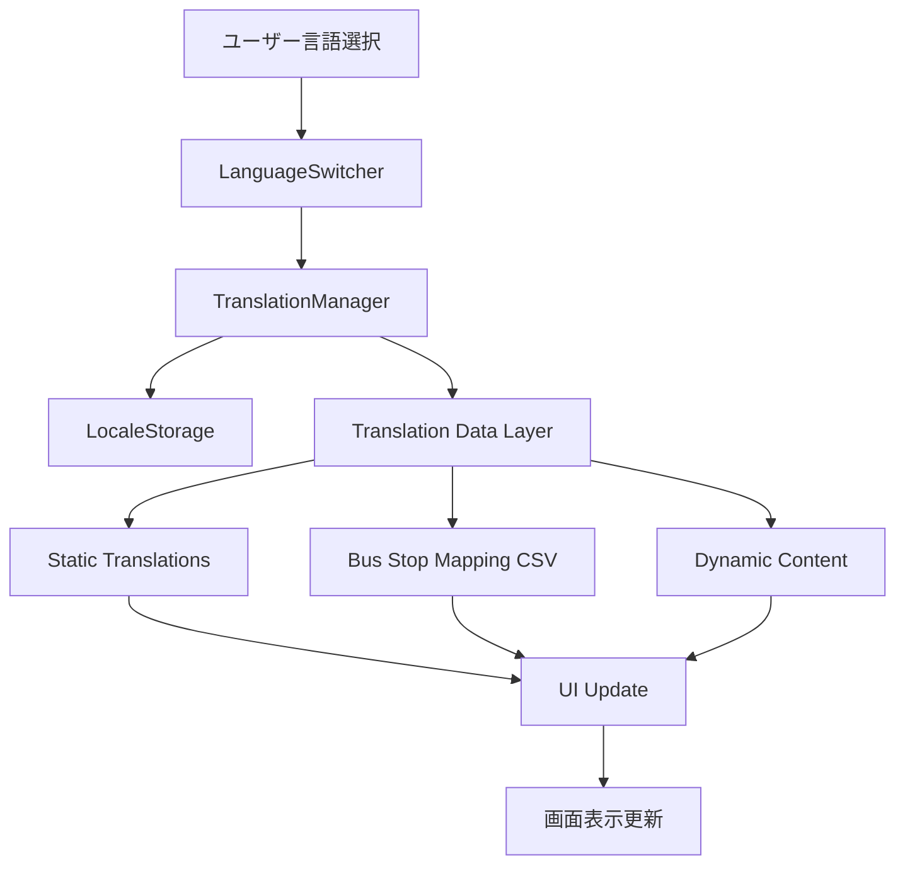

# 多言語対応機能 設計文書

## 概要

佐賀バスナビゲーターアプリに多言語対応機能を追加し、日本語と英語の切り替えを可能にする。現在のアプリケーションアーキテクチャを維持しながら、国際化（I18N）システムを統合し、バス停マッピングCSVファイルを活用した正確な翻訳を提供する。

## アーキテクチャ

### システム構成

```
佐賀バスナビ多言語対応システム
├── I18N Core System
│   ├── TranslationManager (翻訳管理)
│   ├── LanguageDetector (言語検出)
│   └── LocaleStorage (設定保存)
├── Translation Data Layer
│   ├── Static Translations (静的翻訳)
│   ├── Bus Stop Mapping (バス停マッピング)
│   └── Dynamic Content (動的コンテンツ)
├── UI Components
│   ├── LanguageSwitcher (言語切り替え)
│   ├── TranslatedText (翻訳テキスト)
│   └── LocalizedContent (ローカライズコンテンツ)
└── Integration Layer
    ├── Existing Controllers (既存コントローラー)
    ├── Data Loaders (データローダー)
    └── Map Controllers (地図コントローラー)
```

### データフロー



## コンポーネントとインターフェース

### 1. TranslationManager

**責任**: 翻訳システムの中核管理

```javascript
class TranslationManager {
  constructor()
  setLanguage(locale: string): void
  getLanguage(): string
  translate(key: string, params?: object): string
  translateBusStop(japaneseStopName: string): string
  loadTranslations(locale: string): Promise<void>
  isTranslationLoaded(locale: string): boolean
}
```

### 2. LanguageSwitcher

**責任**: 言語切り替えプルダウンUI制御

```javascript
class LanguageSwitcher {
  constructor(container: HTMLElement, translationManager: TranslationManager)
  render(): void
  renderDropdown(): void
  handleLanguageChange(locale: string): void
  updateActiveState(): void
  toggleDropdown(): void
  closeDropdown(): void
}
```

### 3. BusStopTranslator

**責任**: バス停名の翻訳処理

```javascript
class BusStopTranslator {
  constructor(mappingData: Array<BusStopMapping>)
  translateStopName(japaneseStopName: string): string
  loadMappingData(): Promise<void>
  getMappingSource(japaneseStopName: string): 'Mapped' | 'Auto-translated' | null
}
```

### 4. LocaleStorage

**責任**: 言語設定の永続化

```javascript
class LocaleStorage {
  static getLanguage(): string
  static setLanguage(locale: string): void
  static getDefaultLanguage(): string
}
```

## データモデル

### 翻訳データ構造

```javascript
// 静的翻訳ファイル構造 (translations/ja.json, translations/en.json)
{
  "app": {
    "title": "佐賀バスナビ",
    "subtitle": "時刻表検索"
  },
  "search": {
    "departure_stop": "乗車バス停",
    "arrival_stop": "降車バス停",
    "search_button": "検索",
    "clear_results": "検索結果をクリア"
  },
  "time": {
    "weekday": "平日",
    "weekend": "土日祝",
    "departure_time": "出発時刻指定",
    "arrival_time": "到着時刻指定",
    "now": "今すぐ",
    "first_bus": "始発",
    "last_bus": "終電"
  },
  "results": {
    "loading": "データを読み込んでいます...",
    "no_results": "該当する便が見つかりませんでした",
    "route": "路線",
    "departure": "出発",
    "arrival": "到着",
    "fare": "運賃",
    "duration": "所要時間"
  },
  "map": {
    "select_from_map": "地図から選択",
    "clear_route": "経路をクリア",
    "direction_both": "両方向",
    "direction_outbound": "往路",
    "direction_inbound": "復路"
  },
  "footer": {
    "usage": "使い方",
    "contact": "お問い合わせ",
    "data_source": "リアルタイムデータ提供"
  },
  "modal": {
    "close": "閉じる",
    "calendar_register": "カレンダーに登録",
    "ical_download": "iCal形式でダウンロード",
    "google_calendar": "Google Calendarで開く"
  },
  "error": {
    "data_load_failed": "データの読み込みに失敗しました",
    "retry": "再試行",
    "invalid_time": "正しい時刻を入力してください",
    "select_stops": "乗車・降車バス停を選択してください"
  }
}
```

### バス停マッピングデータ構造

```javascript
// data/bus_stops_mapping.csv から読み込まれるデータ
interface BusStopMapping {
  japanese: string;    // 日本語バス停名
  english: string;     // 英語バス停名
  source: 'Mapped' | 'Auto-translated';  // 翻訳ソース
}
```

### 言語設定データ

```javascript
interface LanguageConfig {
  code: string;        // 'ja', 'en'
  name: string;        // '日本語', 'English'
  flag: string;        // '🇯🇵', '🇺🇸'
  direction: 'ltr' | 'rtl';  // テキスト方向
}
```

## 正確性プロパティ

*プロパティとは、システムの全ての有効な実行において真であるべき特性や動作のことです。プロパティは人間が読める仕様と機械で検証可能な正確性保証の橋渡しをします。*

### プロパティ1: 言語切り替えの一貫性
*任意の*言語選択に対して、アプリケーション全体の翻訳可能なテキストが選択された言語で一貫して表示される
**検証対象: 要件 1.2**

### プロパティ2: 言語設定の永続化
*任意の*言語設定に対して、設定後にアプリケーションを再起動しても同じ言語設定が維持される
**検証対象: 要件 1.3, 1.4**

### プロパティ3: 翻訳キーの解決
*任意の*有効な翻訳キーに対して、現在のロケールに対応する翻訳テキストが返される
**検証対象: 要件 2.2**

### プロパティ4: フォールバック翻訳
*任意の*存在しない翻訳キーに対して、フォールバック言語（日本語）のテキストまたはキー名が表示される
**検証対象: 要件 2.3, 2.5**

### プロパティ5: バス停名翻訳の優先順位
*任意の*バス停名に対して、手動マッピング（Mapped）が利用可能な場合は機械翻訳（Auto-translated）より優先して使用される
**検証対象: 要件 6.2, 6.3**

### プロパティ6: バス停マッピングのフォールバック
*任意の*バス停名に対して、マッピングファイルに該当する翻訳が存在しない場合は元の日本語名が表示される
**検証対象: 要件 6.4**

### プロパティ7: 翻訳データの構造整合性
*任意の*翻訳ファイルに対して、JSON形式で構造化され、必要なキーが含まれている
**検証対象: 要件 5.1, 5.3**

### プロパティ8: UI状態の視覚的一貫性
*任意の*言語切り替え操作に対して、現在選択されている言語が視覚的に正しく示される
**検証対象: 要件 4.2**

## エラーハンドリング

### エラー処理戦略

1. **翻訳ファイル読み込みエラー**
   - フォールバック言語（日本語）を使用
   - コンソールに警告メッセージを出力
   - ユーザーには通常通りの動作を提供

2. **バス停マッピングファイルエラー**
   - 元の日本語バス停名を表示
   - エラーログを出力
   - アプリケーションの基本機能は継続

3. **無効な翻訳キーエラー**
   - キー名をそのまま表示
   - 開発者コンソールに警告を出力
   - アプリケーションクラッシュを防止

4. **ローカルストレージエラー**
   - デフォルト言語（日本語）を使用
   - セッション中の言語設定は維持
   - 次回起動時にデフォルトに戻る

### エラーメッセージの多言語対応

```javascript
const errorMessages = {
  ja: {
    translation_load_failed: "翻訳データの読み込みに失敗しました",
    bus_stop_mapping_failed: "バス停マッピングの読み込みに失敗しました",
    invalid_language: "無効な言語が選択されました"
  },
  en: {
    translation_load_failed: "Failed to load translation data",
    bus_stop_mapping_failed: "Failed to load bus stop mapping",
    invalid_language: "Invalid language selected"
  }
};
```

## テスト戦略

### 単体テスト

**対象コンポーネント**:
- TranslationManager: 翻訳キーの解決、言語切り替え
- BusStopTranslator: バス停名の翻訳、マッピング優先順位
- LanguageSwitcher: UI状態管理、イベントハンドリング
- LocaleStorage: 設定の保存・読み込み

**テストケース例**:
- 有効な翻訳キーの解決
- 無効な翻訳キーのフォールバック
- バス停マッピングの優先順位
- 言語設定の永続化

### プロパティベーステスト

**使用ライブラリ**: fast-check (JavaScript用プロパティベーステストライブラリ)

**テスト設定**: 各プロパティテストは最低100回の反復実行

**プロパティテスト例**:
- 任意の翻訳キーに対する一貫した翻訳結果
- 任意のバス停名に対する翻訳優先順位の正確性
- 任意の言語設定に対する永続化の正確性

### 統合テスト

**対象シナリオ**:
- 言語切り替え後のページ全体の翻訳更新
- バス停検索結果の多言語表示
- 時刻表モーダルの多言語表示
- エラー状態での多言語メッセージ表示

### E2Eテスト

**対象フロー**:
- 初回アクセス時の言語検出
- 言語切り替えボタンの操作
- 言語設定の永続化確認
- 各画面での翻訳表示確認

## 実装詳細

### ファイル構成

```
js/
├── i18n/
│   ├── translation-manager.js      # 翻訳管理システム
│   ├── language-switcher.js        # 言語切り替えUI
│   ├── bus-stop-translator.js      # バス停翻訳システム
│   └── locale-storage.js           # 言語設定保存
├── translations/
│   ├── ja.json                     # 日本語翻訳
│   └── en.json                     # 英語翻訳
└── (既存ファイル)
```

### 既存システムとの統合

#### 1. HTMLテンプレートの更新

```html
<!-- 言語切り替えプルダウンをフッターに追加 -->
<footer class="footer">
  <p class="footer-text">
    <div id="language-switcher" class="language-switcher-dropdown"></div>
    &copy; 2025 佐賀バスナビ | 
    <a href="#usage" class="footer-link">使い方</a> | 
    <a href="#contact" class="footer-link">お問い合わせ</a>
  </p>
  <p class="footer-text">
    リアルタイムデータ提供: <a href="http://opendata.sagabus.info/" class="footer-link" target="_blank" rel="noopener noreferrer">佐賀バスオープンデータ</a>
  </p>
</footer>

<!-- 既存の要素に翻訳属性を追加 -->
<label for="departure-stop" class="form-label" data-i18n="search.departure_stop">乗車バス停</label>
```

#### 2. 既存JavaScriptの拡張

```javascript
// app.js の UIController に翻訳機能を統合
class UIController {
  constructor() {
    // 既存のコンストラクタ
    this.translationManager = new TranslationManager();
    this.languageSwitcher = new LanguageSwitcher(
      document.getElementById('language-switcher'),
      this.translationManager
    );
  }
  
  // 既存メソッドに翻訳機能を追加
  displayResults(results) {
    // 既存の結果表示ロジック
    // + 翻訳されたテキストの適用
  }
}
```

#### 3. データローダーの拡張

```javascript
// data-loader.js にバス停翻訳機能を統合
class DataLoader {
  constructor() {
    // 既存のコンストラクタ
    this.busStopTranslator = new BusStopTranslator();
  }
  
  async loadBusStopMapping() {
    // バス停マッピングCSVの読み込み
    const response = await fetch('/data/bus_stops_mapping.csv');
    const csvText = await response.text();
    return this.parseBusStopMappingCSV(csvText);
  }
}
```

### パフォーマンス考慮事項

#### 1. 翻訳データの遅延読み込み

```javascript
// 初期読み込み時は日本語のみ、言語切り替え時に英語を読み込み
class TranslationManager {
  async loadTranslations(locale) {
    if (this.loadedLocales.has(locale)) {
      return; // 既に読み込み済み
    }
    
    const translations = await fetch(`/js/translations/${locale}.json`);
    this.translations[locale] = await translations.json();
    this.loadedLocales.add(locale);
  }
}
```

#### 2. バス停マッピングのキャッシュ

```javascript
// バス停マッピングをメモリにキャッシュして高速化
class BusStopTranslator {
  constructor() {
    this.mappingCache = new Map();
    this.loadMappingData();
  }
  
  translateStopName(japaneseStopName) {
    if (this.mappingCache.has(japaneseStopName)) {
      return this.mappingCache.get(japaneseStopName);
    }
    // フォールバック処理
    return japaneseStopName;
  }
}
```

### セキュリティ考慮事項

#### 1. XSS対策

```javascript
// 翻訳テキストの安全な挿入
class TranslationManager {
  translate(key, params = {}) {
    let text = this.getTranslationText(key);
    
    // パラメータの安全な置換
    Object.keys(params).forEach(param => {
      const safeValue = this.escapeHtml(params[param]);
      text = text.replace(`{{${param}}}`, safeValue);
    });
    
    return text;
  }
  
  escapeHtml(text) {
    const div = document.createElement('div');
    div.textContent = text;
    return div.innerHTML;
  }
}
```

#### 2. CSVインジェクション対策

```javascript
// バス停マッピングCSVの安全な解析
class BusStopTranslator {
  parseBusStopMappingCSV(csvText) {
    const lines = csvText.split('\n');
    const mappings = [];
    
    for (let i = 1; i < lines.length; i++) { // ヘッダーをスキップ
      const [japanese, english, source] = this.parseCSVLine(lines[i]);
      
      // 値の検証
      if (this.isValidBusStopName(japanese) && this.isValidBusStopName(english)) {
        mappings.push({ japanese, english, source });
      }
    }
    
    return mappings;
  }
}
```

### アクセシビリティ対応

#### 1. スクリーンリーダー対応

```html
<!-- 言語切り替えプルダウンのアクセシビリティ -->
<div class="language-switcher-dropdown" role="combobox" aria-label="言語選択" aria-expanded="false">
  <button type="button" 
          class="language-dropdown-button" 
          aria-haspopup="listbox"
          aria-label="現在の言語: 日本語">
    🇯🇵 日本語 ▼
  </button>
  <ul class="language-dropdown-menu" role="listbox" hidden>
    <li role="option" aria-selected="true">
      <button type="button" data-locale="ja">🇯🇵 日本語</button>
    </li>
    <li role="option" aria-selected="false">
      <button type="button" data-locale="en">🇺🇸 English</button>
    </li>
  </ul>
</div>
```

#### 2. キーボードナビゲーション

```javascript
// 言語切り替えボタンのキーボード操作
class LanguageSwitcher {
  setupKeyboardNavigation() {
    this.container.addEventListener('keydown', (event) => {
      if (event.key === 'Enter' || event.key === ' ') {
        event.preventDefault();
        this.handleLanguageChange(event.target.dataset.locale);
      }
    });
  }
}
```

### CSS設計

#### 言語切り替えプルダウンのスタイル

```css
/* 言語切り替えプルダウン */
.language-switcher-dropdown {
  position: relative;
  display: inline-block;
  margin-right: 1rem;
}

.language-dropdown-button {
  background: transparent;
  border: 1px solid #ccc;
  border-radius: 4px;
  padding: 0.25rem 0.5rem;
  font-size: 0.875rem;
  color: inherit;
  cursor: pointer;
  display: flex;
  align-items: center;
  gap: 0.25rem;
}

.language-dropdown-button:hover {
  background-color: rgba(0, 0, 0, 0.05);
}

.language-dropdown-menu {
  position: absolute;
  bottom: 100%;
  left: 0;
  background: white;
  border: 1px solid #ccc;
  border-radius: 4px;
  box-shadow: 0 2px 8px rgba(0, 0, 0, 0.1);
  list-style: none;
  margin: 0;
  padding: 0;
  min-width: 120px;
  z-index: 1000;
}

.language-dropdown-menu li {
  margin: 0;
}

.language-dropdown-menu button {
  width: 100%;
  background: transparent;
  border: none;
  padding: 0.5rem;
  text-align: left;
  cursor: pointer;
  display: flex;
  align-items: center;
  gap: 0.5rem;
}

.language-dropdown-menu button:hover {
  background-color: #f5f5f5;
}

.language-dropdown-menu [aria-selected="true"] button {
  background-color: #e3f2fd;
  font-weight: bold;
}

/* レスポンシブ対応 */
@media (max-width: 768px) {
  .language-switcher-dropdown {
    margin-right: 0.5rem;
  }
  
  .language-dropdown-button {
    font-size: 0.75rem;
    padding: 0.2rem 0.4rem;
  }
}
```

### 将来の拡張性

#### 1. 新言語の追加

```javascript
// 新しい言語の簡単な追加
const supportedLanguages = [
  { code: 'ja', name: '日本語', flag: '🇯🇵' },
  { code: 'en', name: 'English', flag: '🇺🇸' },
  // 将来的に追加可能
  // { code: 'ko', name: '한국어', flag: '🇰🇷' },
  // { code: 'zh', name: '中文', flag: '🇨🇳' }
];
```

#### 2. 動的翻訳の対応

```javascript
// 将来的なAPI翻訳サービスとの統合準備
class TranslationManager {
  async translateDynamic(text, targetLocale) {
    // 将来的にGoogle Translate APIなどと統合
    // 現在は静的翻訳のみ対応
    return this.getStaticTranslation(text, targetLocale);
  }
}
```