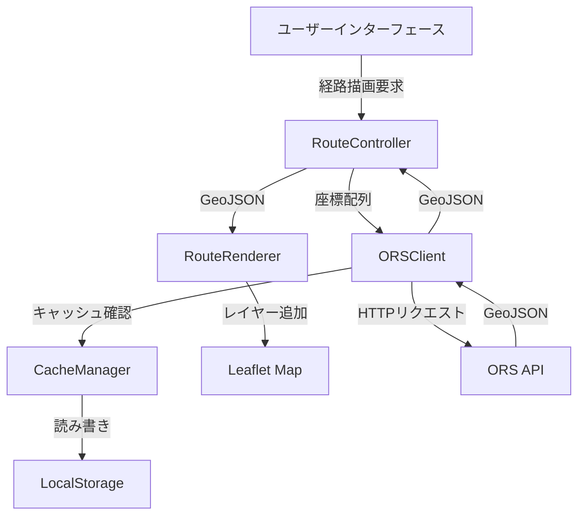

# 設計書

## 概要

OpenRouteService (ORS) APIを使用して、佐賀市バスナビゲーションアプリに道路に沿ったバス経路描画機能を追加します。この機能は、既存のLeaflet地図実装に統合され、バス停間の経路を実際の道路ネットワークに沿って表示します。

### 設計目標

1. **API効率性**: 無料プランの制限内で動作（2000リクエスト/日、40リクエスト/分）
2. **パフォーマンス**: キャッシュとデバウンスによる高速な応答
3. **シームレスな統合**: 既存のLeaflet実装との互換性
4. **エラー耐性**: APIエラー時のフォールバック機能
5. **保守性**: モジュール化された設計

## アーキテクチャ

### システム構成図



### レイヤー構造

1. **プレゼンテーション層**: ユーザーインターフェース、地図表示
2. **コントロール層**: RouteController（経路描画のオーケストレーション）
3. **サービス層**: ORSClient（API通信）、CacheManager（キャッシュ管理）
4. **レンダリング層**: RouteRenderer（地図への描画）

## コンポーネントとインターフェース

### 1. ORSClient

ORS APIとの通信を担当するクライアント。

#### 責務
- ORS Directions APIへのHTTPリクエスト
- 座標形式の変換（[lat, lon] → [lon, lat]）
- レート制限の管理
- エラーハンドリングと再試行

#### インターフェース

```javascript
class ORSClient {
  constructor(config) {
    this.apiKey = config.apiKey;
    this.baseUrl = config.baseUrl || 'https://api.openrouteservice.org/v2';
    this.profile = config.profile || 'driving-car';
    this.rateLimiter = new RateLimiter(40, 60000); // 40リクエスト/分
  }

  /**
   * 座標配列から経路を取得
   * @param {Array<{lat: number, lon: number}>} coordinates - 座標配列
   * @returns {Promise<Object>} GeoJSON形式の経路データ
   */
  async getRoute(coordinates) {
    // 実装詳細は後述
  }

  /**
   * 座標を[lat, lon]から[lon, lat]に変換
   * @param {Array<{lat: number, lon: number}>} coords
   * @returns {Array<[number, number]>}
   */
  convertCoordinates(coords) {
    return coords.map(c => [c.lon, c.lat]);
  }

  /**
   * 座標の妥当性を検証
   * @param {Array<{lat: number, lon: number}>} coords
   * @returns {boolean}
   */
  validateCoordinates(coords) {
    return coords.every(c => 
      c.lat >= -90 && c.lat <= 90 &&
      c.lon >= -180 && c.lon <= 180
    );
  }
}
```

### 2. CacheManager

API応答のキャッシュを管理。

#### 責務
- 経路データのキャッシュ保存・取得
- キャッシュキーの生成
- キャッシュの有効期限管理
- ストレージエラーのハンドリング

#### インターフェース

```javascript
class CacheManager {
  constructor(config) {
    this.storage = config.storage || window.localStorage;
    this.prefix = config.prefix || 'ors_route_';
    this.ttl = config.ttl || 86400000; // 24時間（ミリ秒）
  }

  /**
   * キャッシュから経路を取得
   * @param {Array<[number, number]>} coordinates
   * @returns {Object|null} キャッシュされたGeoJSON、または null
   */
  get(coordinates) {
    const key = this.generateKey(coordinates);
    try {
      const cached = this.storage.getItem(this.prefix + key);
      if (!cached) return null;
      
      const data = JSON.parse(cached);
      if (Date.now() - data.timestamp > this.ttl) {
        this.storage.removeItem(this.prefix + key);
        return null;
      }
      return data.geojson;
    } catch (error) {
      console.warn('Cache read error:', error);
      return null;
    }
  }

  /**
   * 経路をキャッシュに保存
   * @param {Array<[number, number]>} coordinates
   * @param {Object} geojson
   */
  set(coordinates, geojson) {
    const key = this.generateKey(coordinates);
    try {
      const data = {
        geojson: geojson,
        timestamp: Date.now()
      };
      this.storage.setItem(this.prefix + key, JSON.stringify(data));
    } catch (error) {
      console.warn('Cache write error:', error);
      // エラーでも処理は続行
    }
  }

  /**
   * 座標配列からキャッシュキーを生成
   * @param {Array<[number, number]>} coordinates
   * @returns {string}
   */
  generateKey(coordinates) {
    return coordinates.map(c => `${c[0].toFixed(4)},${c[1].toFixed(4)}`).join('|');
  }

  /**
   * 全てのキャッシュをクリア
   */
  clear() {
    const keys = Object.keys(this.storage);
    keys.forEach(key => {
      if (key.startsWith(this.prefix)) {
        this.storage.removeItem(key);
      }
    });
  }
}
```

### 3. RouteRenderer

Leaflet地図上に経路を描画。

#### 責務
- GeoJSONレイヤーの作成と追加
- 経路スタイルの適用
- レイヤー参照の管理
- 経路のクリア

#### インターフェース

```javascript
class RouteRenderer {
  constructor(map, config) {
    this.map = map; // Leaflet map instance
    this.routeLayers = new Map(); // routeId -> L.GeoJSON
    this.style = config.style || {
      color: '#2196F3',
      weight: 4,
      opacity: 0.7
    };
  }

  /**
   * 経路を地図に描画
   * @param {string} routeId - 経路の識別子
   * @param {Object} geojson - GeoJSON形式の経路データ
   * @param {Object} options - 描画オプション
   */
  drawRoute(routeId, geojson, options = {}) {
    // 既存の経路を削除
    this.removeRoute(routeId);
    
    const style = { ...this.style, ...options.style };
    const layer = L.geoJSON(geojson, {
      style: style,
      onEachFeature: (feature, layer) => {
        if (options.popup) {
          layer.bindPopup(options.popup);
        }
      }
    });
    
    layer.addTo(this.map);
    this.routeLayers.set(routeId, layer);
    
    if (options.fitBounds) {
      this.map.fitBounds(layer.getBounds());
    }
  }

  /**
   * 特定の経路を削除
   * @param {string} routeId
   */
  removeRoute(routeId) {
    const layer = this.routeLayers.get(routeId);
    if (layer) {
      this.map.removeLayer(layer);
      this.routeLayers.delete(routeId);
    }
  }

  /**
   * 全ての経路を削除
   */
  clearAllRoutes() {
    this.routeLayers.forEach((layer, routeId) => {
      this.map.removeLayer(layer);
    });
    this.routeLayers.clear();
  }

  /**
   * 経路が表示されているか確認
   * @param {string} routeId
   * @returns {boolean}
   */
  hasRoute(routeId) {
    return this.routeLayers.has(routeId);
  }
}
```

### 4. RouteController

経路描画のオーケストレーション。

#### 責務
- ユーザーアクションのハンドリング
- ORSClientとRouteRendererの調整
- エラーハンドリング
- デバウンス処理

#### インターフェース

```javascript
class RouteController {
  constructor(orsClient, cacheManager, routeRenderer) {
    this.orsClient = orsClient;
    this.cacheManager = cacheManager;
    this.routeRenderer = routeRenderer;
    this.pendingRequests = new Map();
    this.debounceDelay = 300; // ミリ秒
  }

  /**
   * バス停配列から経路を描画
   * @param {string} routeId - 経路の識別子
   * @param {Array<{lat: number, lon: number}>} busStops - バス停座標配列
   * @param {Object} options - 描画オプション
   */
  async drawBusRoute(routeId, busStops, options = {}) {
    // デバウンス処理
    if (this.pendingRequests.has(routeId)) {
      clearTimeout(this.pendingRequests.get(routeId));
    }
    
    return new Promise((resolve, reject) => {
      const timeoutId = setTimeout(async () => {
        this.pendingRequests.delete(routeId);
        
        try {
          // 既に表示されている場合はスキップ
          if (this.routeRenderer.hasRoute(routeId) && !options.force) {
            resolve();
            return;
          }
          
          // 座標を変換
          const coordinates = this.orsClient.convertCoordinates(busStops);
          
          // キャッシュを確認
          let geojson = this.cacheManager.get(coordinates);
          
          if (!geojson) {
            // APIから取得
            geojson = await this.orsClient.getRoute(busStops);
            
            // キャッシュに保存
            this.cacheManager.set(coordinates, geojson);
          }
          
          // 地図に描画
          this.routeRenderer.drawRoute(routeId, geojson, options);
          
          resolve();
        } catch (error) {
          console.error('Route drawing error:', error);
          
          // フォールバック: 直線で描画
          if (options.fallback !== false) {
            this.drawStraightLine(routeId, busStops, options);
          }
          
          reject(error);
        }
      }, this.debounceDelay);
      
      this.pendingRequests.set(routeId, timeoutId);
    });
  }

  /**
   * フォールバック: 直線で経路を描画
   * @param {string} routeId
   * @param {Array<{lat: number, lon: number}>} busStops
   * @param {Object} options
   */
  drawStraightLine(routeId, busStops, options = {}) {
    const geojson = {
      type: 'FeatureCollection',
      features: [{
        type: 'Feature',
        geometry: {
          type: 'LineString',
          coordinates: busStops.map(stop => [stop.lon, stop.lat])
        },
        properties: {}
      }]
    };
    
    this.routeRenderer.drawRoute(routeId, geojson, {
      ...options,
      style: { ...options.style, dashArray: '5, 10' } // 破線で表示
    });
  }

  /**
   * 経路を削除
   * @param {string} routeId
   */
  removeRoute(routeId) {
    this.routeRenderer.removeRoute(routeId);
  }

  /**
   * 全ての経路を削除
   */
  clearAllRoutes() {
    this.routeRenderer.clearAllRoutes();
  }
}
```

### 5. RateLimiter

APIレート制限を管理。

#### 責務
- リクエスト数のカウント
- レート制限の判定
- リクエストのキューイング

#### インターフェース

```javascript
class RateLimiter {
  constructor(maxRequests, timeWindow) {
    this.maxRequests = maxRequests; // 最大リクエスト数
    this.timeWindow = timeWindow; // 時間枠（ミリ秒）
    this.requests = []; // タイムスタンプの配列
  }

  /**
   * リクエストが許可されるか確認
   * @returns {boolean}
   */
  canMakeRequest() {
    this.cleanOldRequests();
    return this.requests.length < this.maxRequests;
  }

  /**
   * リクエストを記録
   */
  recordRequest() {
    this.requests.push(Date.now());
  }

  /**
   * 古いリクエスト記録を削除
   */
  cleanOldRequests() {
    const now = Date.now();
    this.requests = this.requests.filter(
      timestamp => now - timestamp < this.timeWindow
    );
  }

  /**
   * 次のリクエストまでの待機時間を取得
   * @returns {number} ミリ秒
   */
  getWaitTime() {
    if (this.canMakeRequest()) return 0;
    
    this.cleanOldRequests();
    if (this.requests.length === 0) return 0;
    
    const oldestRequest = this.requests[0];
    return this.timeWindow - (Date.now() - oldestRequest);
  }
}
```

## データモデル

### 座標オブジェクト

```javascript
/**
 * バス停座標
 * @typedef {Object} BusStopCoordinate
 * @property {number} lat - 緯度（-90 ~ 90）
 * @property {number} lon - 経度（-180 ~ 180）
 * @property {string} [stopId] - バス停ID（オプション）
 * @property {string} [stopName] - バス停名（オプション）
 */
```

### ORS APIリクエスト

```javascript
/**
 * ORS Directions APIリクエストボディ
 * @typedef {Object} ORSRequest
 * @property {Array<[number, number]>} coordinates - [経度, 緯度]のペア配列
 * @property {string} [profile] - ルーティングプロファイル（デフォルト: 'driving-car'）
 * @property {Object} [options] - 追加オプション
 */
```

### ORS APIレスポンス

```javascript
/**
 * ORS Directions APIレスポンス
 * @typedef {Object} ORSResponse
 * @property {string} type - 'FeatureCollection'
 * @property {Array<Object>} features - GeoJSON features
 * @property {Object} features[].geometry - LineString geometry
 * @property {Array<[number, number]>} features[].geometry.coordinates - 経路座標
 * @property {Object} features[].properties - メタデータ
 * @property {Array<Object>} features[].properties.segments - 経路区間情報
 * @property {number} features[].properties.segments[].distance - 距離（メートル）
 * @property {number} features[].properties.segments[].duration - 所要時間（秒）
 */
```

### キャッシュエントリ

```javascript
/**
 * キャッシュエントリ
 * @typedef {Object} CacheEntry
 * @property {Object} geojson - GeoJSON形式の経路データ
 * @property {number} timestamp - キャッシュ保存時刻（ミリ秒）
 */
```

## 正確性プロパティ

*プロパティとは、システムの全ての有効な実行において真であるべき特性や振る舞いのことです。プロパティは、人間が読める仕様と機械で検証可能な正確性保証の橋渡しとなります。*

### プロパティリフレクション

事前分析から以下の冗長性を特定しました:

1. **座標変換プロパティ（1.2と7.1）**: 両方とも[lat, lon]から[lon, lat]への変換を検証 → 統合
2. **キャッシュ優先プロパティ（4.2と4.3）**: 両方ともキャッシュヒット時のAPI呼び出し回避を検証 → 統合
3. **無効座標拒否プロパティ（6.4と7.5）**: 両方とも無効座標でのAPI呼び出し防止を検証 → 統合
4. **座標範囲検証プロパティ（7.3と7.4）**: 緯度と経度の範囲検証は1つの包括的なプロパティに統合可能 → 統合

### 正確性プロパティ

#### プロパティ1: 座標変換の正確性

*任意の*有効なバス停座標配列に対して、座標変換関数は各座標を[緯度, 経度]形式から[経度, 緯度]形式に正しく変換しなければならない

**検証要件: 1.2, 7.1**

#### プロパティ2: APIリクエストヘッダーの完全性

*任意の*ORS APIリクエストに対して、Authorizationヘッダーに有効なAPIキーが含まれていなければならない

**検証要件: 1.1**

#### プロパティ3: GeoJSONパースの正確性

*任意の*有効なORS APIレスポンスに対して、システムはGeoJSON geometryを正しく抽出し、パースしなければならない

**検証要件: 1.3**

#### プロパティ4: APIエラーハンドリング

*任意の*APIエラーレスポンスに対して、システムはエラーをログに記録し、失敗ステータスを返さなければならない

**検証要件: 1.4**

#### プロパティ5: リクエストボディの構造

*任意の*座標配列に対して、構築されるAPIリクエストボディは"coordinates"フィールドに座標ペアの配列を含まなければならない

**検証要件: 1.5**

#### プロパティ6: 経路レイヤーの作成

*任意の*有効なGeoJSONに対して、経路描画器はLeaflet地図上にレイヤーを作成し、追加しなければならない

**検証要件: 2.1**

#### プロパティ7: スタイルの一貫性

*任意の*複数区間を持つ経路に対して、全ての区間は同一のスタイル設定で描画されなければならない

**検証要件: 2.2, 2.3**

#### プロパティ8: レイヤー参照の保存

*任意の*描画された経路に対して、経路描画器は内部マップにLeafletレイヤーへの参照を保存しなければならない

**検証要件: 2.4**

#### プロパティ9: 経路クリアの完全性

*任意の*経路セットに対して、clearAllRoutes呼び出し後、全てのレイヤーが地図から削除され、内部マップが空になっていなければならない

**検証要件: 2.5**

#### プロパティ10: 日次レート制限

*任意の*24時間の期間において、システムは2000回を超えるDirections APIリクエストを行ってはならない

**検証要件: 3.1**

#### プロパティ11: 分次レート制限

*任意の*60秒の期間において、システムは40回を超えるDirections APIリクエストを行ってはならない

**検証要件: 3.2**

#### プロパティ12: レート制限超過時の動作

*任意の*レート制限超過状態において、システムはキャッシュされた結果を返すか、エラーメッセージを表示しなければならない

**検証要件: 3.4**

#### プロパティ13: リクエストカウントの追跡

*任意の*時点において、システムは現在の時間枠内で行われたAPI呼び出しの正確な数を追跡していなければならない

**検証要件: 3.5**

#### プロパティ14: キャッシュの保存と取得（ラウンドトリップ）

*任意の*座標配列とGeoJSONに対して、キャッシュに保存した後に同じ座標配列で取得すると、同じGeoJSONが返されなければならない

**検証要件: 4.1**

#### プロパティ15: キャッシュ優先の実行

*任意の*キャッシュされた経路に対して、経路リクエスト時にAPIが呼び出されず、キャッシュされたGeoJSONが使用されなければならない

**検証要件: 4.2, 4.3**

#### プロパティ16: キャッシュエラー耐性

*任意の*キャッシュストレージエラーに対して、システムはエラーをスローせずにAPI呼び出しを続行しなければならない

**検証要件: 4.5**

#### プロパティ17: ズームレベル連動の経路表示

*任意の*ズームアウト操作に対して、ズームレベルが閾値を下回った場合、システムは詳細な経路描画を非表示にしなければならない

**検証要件: 5.4**

#### プロパティ18: 検索フィルタリング

*任意の*バス検索クエリに対して、システムは検索条件に一致する経路のみを描画しなければならない

**検証要件: 5.5**

#### プロパティ19: APIエラー時のフォールバック

*任意の*ORS API障害に対して、システムはフォールバックとして直線経路を表示しなければならない

**検証要件: 6.1**

#### プロパティ20: 指数バックオフ再試行

*任意の*ネットワークエラーに対して、システムは指数バックオフで最大3回リクエストを再試行しなければならない

**検証要件: 6.2**

#### プロパティ21: 座標検証と拒否

*任意の*無効な座標（緯度が-90〜90の範囲外、または経度が-180〜180の範囲外）に対して、システムはAPI呼び出しを行う前にリクエストを拒否しなければならない

**検証要件: 6.4, 7.3, 7.4, 7.5**

#### プロパティ22: 既存マーカーの保持

*任意の*経路描画操作に対して、地図上の既存のバス停マーカーは削除されず、維持されなければならない

**検証要件: 8.1**

#### プロパティ23: 既存ポップアップ機能の保持

*任意の*経路描画後において、バス停マーカーのクリックイベントは引き続き既存のポップアップ情報を表示しなければならない

**検証要件: 8.2**

#### プロパティ24: ビュー状態の保持

*任意の*経路描画操作に対して、fitBoundsオプションが明示的に指定されない限り、地図のズームレベルと中心座標は変更されてはならない

**検証要件: 8.4**

#### プロパティ25: 冪等性（重複描画の防止）

*任意の*経路IDに対して、同じ経路を複数回描画要求しても、実際の描画処理は1回のみ実行されなければならない（forceオプションが指定されない限り）

**検証要件: 9.2**

#### プロパティ26: デバウンス動作

*任意の*短時間（デバウンス期間内）に連続する経路リクエストに対して、実際のAPI呼び出しは最後のリクエストに対してのみ1回実行されなければならない

**検証要件: 9.3**

#### プロパティ27: 座標数の制限

*任意の*座標配列に対して、システムは1回のORS APIリクエストで送信する座標点の数を50以下に制限しなければならない

**検証要件: 9.5**

#### プロパティ28: ルーティングプロファイルの設定可能性

*任意の*有効なルーティングプロファイル（driving-car, foot-walkingなど）に対して、システムは設定されたプロファイルをAPIリクエストで使用しなければならない

**検証要件: 10.3**

#### プロパティ29: キャッシュTTLの設定可能性

*任意の*TTL設定値に対して、キャッシュエントリはTTL経過後に無効となり、再取得されなければならない

**検証要件: 10.4**

#### プロパティ30: デフォルト値の使用

*任意の*設定値が欠落している場合において、システムは妥当なデフォルト値を使用しなければならない

**検証要件: 10.5**

## エラーハンドリング

### エラー分類

1. **ネットワークエラー**
   - タイムアウト
   - 接続失敗
   - DNS解決失敗

2. **APIエラー**
   - 400 Bad Request: 無効なリクエスト
   - 401 Unauthorized: 認証失敗
   - 403 Forbidden: アクセス拒否
   - 429 Too Many Requests: レート制限超過
   - 500 Internal Server Error: サーバーエラー

3. **クライアントエラー**
   - 無効な座標
   - 座標数超過
   - キャッシュストレージエラー

### エラーハンドリング戦略

#### ネットワークエラー

```javascript
async function fetchWithRetry(url, options, maxRetries = 3) {
  let lastError;
  
  for (let i = 0; i < maxRetries; i++) {
    try {
      const response = await fetch(url, options);
      return response;
    } catch (error) {
      lastError = error;
      
      // 指数バックオフ
      const delay = Math.pow(2, i) * 1000; // 1秒, 2秒, 4秒
      await new Promise(resolve => setTimeout(resolve, delay));
    }
  }
  
  throw lastError;
}
```

#### APIエラー

```javascript
async function handleAPIResponse(response) {
  if (!response.ok) {
    switch (response.status) {
      case 400:
        throw new Error('無効なリクエストです。座標を確認してください。');
      case 401:
        throw new Error('API認証に失敗しました。APIキーを確認してください。');
      case 429:
        throw new Error('リクエスト制限に達しました。しばらく待ってから再試行してください。');
      case 500:
        throw new Error('サーバーエラーが発生しました。後ほど再試行してください。');
      default:
        throw new Error(`APIエラー: ${response.status}`);
    }
  }
  
  return response.json();
}
```

#### フォールバック処理

```javascript
async function getRouteWithFallback(coordinates) {
  try {
    // ORS APIで経路取得を試行
    return await orsClient.getRoute(coordinates);
  } catch (error) {
    console.warn('ORS API failed, using fallback:', error);
    
    // フォールバック: 直線経路を生成
    return {
      type: 'FeatureCollection',
      features: [{
        type: 'Feature',
        geometry: {
          type: 'LineString',
          coordinates: coordinates.map(c => [c.lon, c.lat])
        },
        properties: {
          fallback: true
        }
      }]
    };
  }
}
```

### ユーザーへのフィードバック

```javascript
function showErrorMessage(error) {
  const messageMap = {
    'NETWORK_ERROR': '通信エラーが発生しました。インターネット接続を確認してください。',
    'RATE_LIMIT': 'リクエスト制限に達しました。しばらく待ってから再試行してください。',
    'INVALID_COORDINATES': '無効な座標が指定されました。',
    'API_ERROR': 'サービスエラーが発生しました。後ほど再試行してください。'
  };
  
  const message = messageMap[error.code] || 'エラーが発生しました。';
  
  // UIにエラーメッセージを表示
  displayNotification(message, 'error');
}
```

## テスト戦略

### デュアルテストアプローチ

本機能のテストは、ユニットテストとプロパティベーステストの両方を使用します。

- **ユニットテスト**: 特定の例、エッジケース、エラー条件を検証
- **プロパティベーステスト**: 全ての入力に対する普遍的なプロパティを検証

両者は補完的であり、包括的なカバレッジに必要です。

### プロパティベーステスト設定

#### テストライブラリ

JavaScriptでは**fast-check**ライブラリを使用します。

```bash
npm install --save-dev fast-check
```

#### テスト設定

各プロパティテストは最低100回の反復を実行します（ランダム化のため）。

```javascript
import fc from 'fast-check';

describe('ORS Route Rendering Properties', () => {
  it('Property 1: 座標変換の正確性', () => {
    fc.assert(
      fc.property(
        fc.array(fc.record({
          lat: fc.double({ min: -90, max: 90 }),
          lon: fc.double({ min: -180, max: 180 })
        }), { minLength: 2, maxLength: 50 }),
        (coordinates) => {
          const converted = orsClient.convertCoordinates(coordinates);
          
          // 各座標が[lon, lat]形式に変換されていることを確認
          return converted.every((coord, i) => 
            coord[0] === coordinates[i].lon &&
            coord[1] === coordinates[i].lat
          );
        }
      ),
      { numRuns: 100 }
    );
  });
});
```

#### タグ形式

各プロパティテストには、設計書のプロパティを参照するコメントタグを付けます。

```javascript
/**
 * Feature: ors-route-rendering, Property 1: 座標変換の正確性
 * 任意の有効なバス停座標配列に対して、座標変換関数は各座標を
 * [緯度, 経度]形式から[経度, 緯度]形式に正しく変換しなければならない
 */
it('Property 1: 座標変換の正確性', () => {
  // テスト実装
});
```

### ユニットテスト戦略

#### 特定の例

```javascript
describe('ORSClient', () => {
  it('should convert coordinates correctly for Saga Station', () => {
    const input = [{ lat: 33.2636, lon: 130.3009 }];
    const expected = [[130.3009, 33.2636]];
    
    const result = orsClient.convertCoordinates(input);
    
    expect(result).toEqual(expected);
  });
});
```

#### エッジケース

```javascript
describe('CacheManager', () => {
  it('should handle empty coordinate array', () => {
    const key = cacheManager.generateKey([]);
    expect(key).toBe('');
  });
  
  it('should handle single coordinate', () => {
    const coords = [[130.3009, 33.2636]];
    const key = cacheManager.generateKey(coords);
    expect(key).toBe('130.3009,33.2636');
  });
});
```

#### エラー条件

```javascript
describe('RouteController', () => {
  it('should fallback to straight line on API error', async () => {
    // APIエラーをモック
    orsClient.getRoute = jest.fn().mockRejectedValue(new Error('API Error'));
    
    const busStops = [
      { lat: 33.2636, lon: 130.3009 },
      { lat: 33.2618, lon: 130.2965 }
    ];
    
    await routeController.drawBusRoute('test-route', busStops);
    
    // 直線が描画されたことを確認
    expect(routeRenderer.hasRoute('test-route')).toBe(true);
  });
});
```

### 統合テスト

```javascript
describe('Route Rendering Integration', () => {
  let map, orsClient, cacheManager, routeRenderer, routeController;
  
  beforeEach(() => {
    // Leaflet地図を初期化
    map = L.map('test-map').setView([33.2636, 130.3009], 14);
    
    // コンポーネントを初期化
    orsClient = new ORSClient({ apiKey: 'test-key' });
    cacheManager = new CacheManager({});
    routeRenderer = new RouteRenderer(map, {});
    routeController = new RouteController(orsClient, cacheManager, routeRenderer);
  });
  
  it('should draw route from cache on second request', async () => {
    const busStops = [
      { lat: 33.2636, lon: 130.3009 },
      { lat: 33.2618, lon: 130.2965 }
    ];
    
    // 最初のリクエスト（APIから取得）
    await routeController.drawBusRoute('route-1', busStops);
    const apiCallCount1 = orsClient.requestCount;
    
    // 2回目のリクエスト（キャッシュから取得）
    await routeController.drawBusRoute('route-1', busStops);
    const apiCallCount2 = orsClient.requestCount;
    
    // API呼び出しが増えていないことを確認
    expect(apiCallCount2).toBe(apiCallCount1);
  });
});
```

### テストカバレッジ目標

- **ユニットテスト**: 各コンポーネントの主要機能をカバー
- **プロパティベーステスト**: 全ての正確性プロパティを実装
- **統合テスト**: コンポーネント間の連携を検証
- **E2Eテスト**: ユーザーシナリオを検証

### テスト実行

```bash
# 全てのテストを実行
npm test

# プロパティベーステストのみ実行
npm test -- --grep "Property"

# カバレッジレポートを生成
npm test -- --coverage
```
