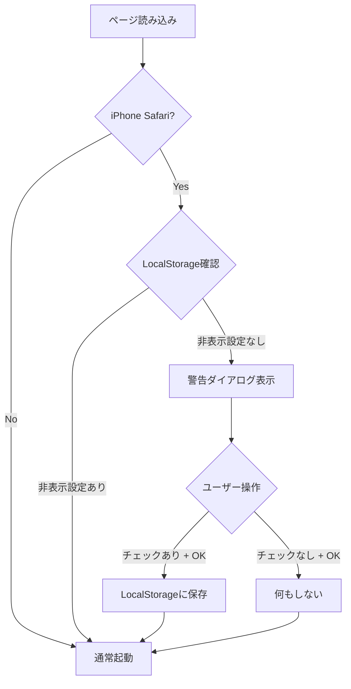

# 設計書

## 概要

iPhone Safariでアクセスしたユーザーに対して、地図表示の不安定性を警告し、Chrome利用を推奨する警告ダイアログを表示する機能を実装します。ユーザーは「今後表示しない」オプションを選択でき、その設定はLocalStorageに永続化されます。

## アーキテクチャ

### システム構成

```
┌─────────────────────────────────────────┐
│         index.html (起動時)              │
└────────────────┬────────────────────────┘
                 │
                 ▼
┌─────────────────────────────────────────┐
│   SafariWarningDialog (新規モジュール)   │
│   - ブラウザ判定                         │
│   - LocalStorage確認                    │
│   - ダイアログ表示制御                   │
└────────────────┬────────────────────────┘
                 │
                 ▼
┌─────────────────────────────────────────┐
│         既存アプリケーション              │
│   (app.js, map-controller.js等)         │
└─────────────────────────────────────────┘
```

### 実行フロー



## コンポーネントと機能

### 1. SafariWarningDialog クラス

新規JavaScriptモジュールとして実装します。

#### 責務
- ブラウザとデバイスの検出
- LocalStorageの読み書き
- 警告ダイアログのDOM生成と表示制御
- ユーザー操作のハンドリング

#### 主要メソッド

```javascript
class SafariWarningDialog {
  constructor() {
    this.storageKey = 'hideIphoneSafariWarning';
    this.dialogElement = null;
  }
  
  // ブラウザ判定
  isIphoneSafari() {
    // UserAgent文字列を解析
    // iPhone && Safari && !Chrome を判定
  }
  
  // LocalStorage確認
  shouldShowWarning() {
    // storageKeyの値を確認
    // 存在しない or false なら true を返す
  }
  
  // ダイアログ表示
  show() {
    // DOMを生成してbodyに追加
    // イベントリスナーを設定
  }
  
  // ダイアログ非表示
  hide() {
    // DOMを削除
    // イベントリスナーをクリーンアップ
  }
  
  // OKボタンクリック処理
  handleOkClick() {
    // チェックボックスの状態を確認
    // チェックされていればLocalStorageに保存
    // ダイアログを閉じる
  }
  
  // 初期化と自動表示
  init() {
    // ブラウザ判定
    // 表示判定
    // 必要なら表示
  }
}
```

### 2. HTML構造

警告ダイアログのDOM構造は動的に生成します。

```html
<div class="safari-warning-overlay" role="dialog" aria-modal="true" aria-labelledby="safari-warning-title">
  <div class="safari-warning-dialog">
    <div class="safari-warning-header">
      <span class="safari-warning-icon">⚠️</span>
      <h2 id="safari-warning-title" class="safari-warning-title">動作環境について</h2>
    </div>
    
    <div class="safari-warning-body">
      <p class="safari-warning-message">
        iPhone版Safariでは地図の読み込みが不安定な場合があります。
      </p>
      <p class="safari-warning-recommendation">
        快適にご利用いただくため、Google Chromeでのアクセスを推奨します。
      </p>
    </div>
    
    <div class="safari-warning-footer">
      <label class="safari-warning-checkbox-label">
        <input type="checkbox" id="safari-warning-checkbox" class="safari-warning-checkbox">
        <span>今後この警告を表示しない</span>
      </label>
      
      <button type="button" class="safari-warning-ok-button">OK</button>
    </div>
  </div>
</div>
```

### 3. CSS設計

既存の `css/app.css` に追加するスタイル定義。

#### デザイン原則
- 既存UIとの一貫性を保つ
- モバイルフレンドリー（最小タップサイズ44x44px）
- アクセシビリティ対応（コントラスト比、フォーカス表示）
- レスポンシブデザイン

#### 主要スタイル

```css
/* オーバーレイ */
.safari-warning-overlay {
  position: fixed;
  top: 0;
  left: 0;
  width: 100%;
  height: 100%;
  background-color: rgba(0, 0, 0, 0.6);
  z-index: 10000;
  display: flex;
  align-items: center;
  justify-content: center;
  padding: 1rem;
}

/* ダイアログ本体 */
.safari-warning-dialog {
  background: white;
  border-radius: 8px;
  max-width: 500px;
  width: 100%;
  box-shadow: 0 4px 16px rgba(0, 0, 0, 0.2);
  animation: slideIn 0.3s ease-out;
}

/* ヘッダー */
.safari-warning-header {
  display: flex;
  align-items: center;
  gap: 0.75rem;
  padding: 1.5rem;
  border-bottom: 1px solid #e0e0e0;
}

.safari-warning-icon {
  font-size: 2rem;
  flex-shrink: 0;
}

.safari-warning-title {
  font-size: 1.25rem;
  font-weight: 600;
  color: #333;
  margin: 0;
}

/* ボディ */
.safari-warning-body {
  padding: 1.5rem;
}

.safari-warning-message {
  font-size: 1rem;
  color: #333;
  line-height: 1.6;
  margin-bottom: 1rem;
}

.safari-warning-recommendation {
  font-size: 1rem;
  color: #0066cc;
  font-weight: 500;
  line-height: 1.6;
}

/* フッター */
.safari-warning-footer {
  padding: 1.5rem;
  border-top: 1px solid #e0e0e0;
  display: flex;
  flex-direction: column;
  gap: 1rem;
}

.safari-warning-checkbox-label {
  display: flex;
  align-items: center;
  gap: 0.5rem;
  cursor: pointer;
  font-size: 0.9375rem;
  color: #666;
}

.safari-warning-checkbox {
  width: 20px;
  height: 20px;
  cursor: pointer;
}

.safari-warning-ok-button {
  width: 100%;
  padding: 0.875rem 1.5rem;
  font-size: 1rem;
  font-weight: 600;
  background-color: #0066cc;
  color: white;
  border: none;
  border-radius: 4px;
  cursor: pointer;
  min-height: 44px;
  transition: all 0.2s;
}

.safari-warning-ok-button:hover {
  background-color: #0052a3;
}

.safari-warning-ok-button:active {
  transform: translateY(1px);
}

/* アニメーション */
@keyframes slideIn {
  from {
    opacity: 0;
    transform: translateY(-20px);
  }
  to {
    opacity: 1;
    transform: translateY(0);
  }
}

/* レスポンシブ対応 */
@media (max-width: 767px) {
  .safari-warning-dialog {
    max-width: 100%;
  }
  
  .safari-warning-header {
    padding: 1.25rem;
  }
  
  .safari-warning-title {
    font-size: 1.125rem;
  }
  
  .safari-warning-body {
    padding: 1.25rem;
  }
  
  .safari-warning-message,
  .safari-warning-recommendation {
    font-size: 0.9375rem;
  }
  
  .safari-warning-footer {
    padding: 1.25rem;
  }
}
```

## データモデル

### LocalStorage

```javascript
// キー
const STORAGE_KEY = 'hideIphoneSafariWarning';

// 値
// - 'true': 警告を表示しない
// - 存在しない or 'false': 警告を表示する
```

### ブラウザ判定ロジック

```javascript
function isIphoneSafari() {
  const ua = navigator.userAgent;
  
  // iPhoneを含む
  const isIphone = /iPhone/.test(ua);
  
  // Safariを含む
  const isSafari = /Safari/.test(ua);
  
  // Chrome/CriOSを含まない（Chrome on iOSを除外）
  const isNotChrome = !/Chrome|CriOS/.test(ua);
  
  return isIphone && isSafari && isNotChrome;
}
```

## エラーハンドリング

### LocalStorageアクセスエラー

```javascript
try {
  localStorage.setItem(key, value);
} catch (error) {
  console.warn('LocalStorageへの保存に失敗しました:', error);
  // エラーが発生しても警告は表示される
  // 次回アクセス時も警告が表示される
}
```

### DOM操作エラー

```javascript
try {
  document.body.appendChild(dialogElement);
} catch (error) {
  console.error('警告ダイアログの表示に失敗しました:', error);
  // エラーが発生してもアプリケーションは継続
}
```

## テスト戦略

### 単体テスト（Vitest）

```javascript
describe('SafariWarningDialog', () => {
  describe('isIphoneSafari', () => {
    test('iPhone Safariを正しく検出する');
    test('iPhone Chromeを除外する');
    test('Android Chromeを除外する');
    test('デスクトップSafariを除外する');
  });
  
  describe('shouldShowWarning', () => {
    test('LocalStorageに設定がない場合はtrueを返す');
    test('LocalStorageにtrueが設定されている場合はfalseを返す');
  });
  
  describe('show/hide', () => {
    test('ダイアログが正しく表示される');
    test('ダイアログが正しく非表示になる');
  });
  
  describe('handleOkClick', () => {
    test('チェックありの場合LocalStorageに保存される');
    test('チェックなしの場合LocalStorageに保存されない');
    test('ダイアログが閉じられる');
  });
});
```

### E2Eテスト（Playwright）

```javascript
describe('Safari警告ダイアログ', () => {
  test('iPhone Safariで初回アクセス時に警告が表示される', async ({ page }) => {
    // UserAgentをiPhone Safariに設定
    // ページにアクセス
    // 警告ダイアログが表示されることを確認
  });
  
  test('「今後表示しない」をチェックしてOKを押すと次回表示されない', async ({ page }) => {
    // UserAgentをiPhone Safariに設定
    // ページにアクセス
    // チェックボックスをチェック
    // OKボタンをクリック
    // ページをリロード
    // 警告ダイアログが表示されないことを確認
  });
  
  test('iPhone Chrome では警告が表示されない', async ({ page }) => {
    // UserAgentをiPhone Chromeに設定
    // ページにアクセス
    // 警告ダイアログが表示されないことを確認
  });
});
```

## セキュリティ考慮事項

### XSS対策

- ダイアログのテキストは全てハードコードされた文字列
- ユーザー入力を含まない
- `textContent`を使用してテキストを設定

### CSP準拠

- インラインスタイルを使用しない
- 全てのスタイルは外部CSSファイルで定義
- 既存のCSP設定に準拠

## パフォーマンス考慮事項

### 初期化タイミング

```javascript
// DOMContentLoadedイベント前に実行
// ページ読み込みをブロックしない
if (document.readyState === 'loading') {
  document.addEventListener('DOMContentLoaded', () => {
    const dialog = new SafariWarningDialog();
    dialog.init();
  });
} else {
  const dialog = new SafariWarningDialog();
  dialog.init();
}
```

### メモリ管理

- ダイアログを閉じる際にイベントリスナーを削除
- DOM要素を完全に削除
- 不要な参照を保持しない

## アクセシビリティ

### ARIA属性

```html
<div role="dialog" aria-modal="true" aria-labelledby="safari-warning-title">
  <h2 id="safari-warning-title">動作環境について</h2>
  <!-- ... -->
</div>
```

### キーボード操作

- Tabキーでフォーカス移動
- Enterキーでボタン押下
- Escapeキーでダイアログを閉じる（オプション）

### スクリーンリーダー対応

- 適切な見出しレベル（h2）
- ラベルとフォームコントロールの関連付け
- 意味のあるテキスト

## 既存機能との統合

### 影響範囲

- **index.html**: 新しいスクリプトタグを追加
- **css/app.css**: 新しいスタイルを追加
- **既存JavaScript**: 影響なし（独立したモジュール）

### 読み込み順序

```html
<!-- 既存のスクリプト -->
<script src="/js/utils.js"></script>
<script src="/js/data-loader.js"></script>
<!-- ... -->

<!-- 新規スクリプト（既存スクリプトの前に配置） -->
<script src="/js/safari-warning-dialog.js"></script>

<!-- 既存のアプリケーション起動 -->
<script src="/js/app.js"></script>
```

### 初期化順序

1. SafariWarningDialog初期化（最優先）
2. 警告ダイアログ表示（必要な場合）
3. 既存アプリケーション初期化（通常通り）

## デプロイメント

### ファイル構成

```
/js/
  safari-warning-dialog.js  (新規)
  app.js                     (既存)
  ...

/css/
  app.css                    (更新)
  ...

index.html                   (更新)
```

### 互換性

- モダンブラウザ対応（ES6+）
- LocalStorage対応ブラウザ
- iOS Safari 12+
- Chrome for iOS

### ロールバック計画

- 新規ファイル削除: `safari-warning-dialog.js`
- index.htmlからスクリプトタグ削除
- css/app.cssから追加スタイル削除

## 将来の拡張性

### 他のブラウザへの対応

```javascript
// 設定オブジェクトで拡張可能
const config = {
  browsers: [
    {
      name: 'iPhone Safari',
      detect: () => isIphoneSafari(),
      message: 'iPhone版Safariでは...',
      storageKey: 'hideIphoneSafariWarning'
    },
    // 将来的に他のブラウザを追加可能
  ]
};
```

### カスタマイズ可能なメッセージ

```javascript
// 設定ファイルでメッセージをカスタマイズ
const messages = {
  title: '動作環境について',
  body: 'iPhone版Safariでは...',
  recommendation: 'Google Chromeでのアクセスを推奨します。',
  checkbox: '今後この警告を表示しない',
  button: 'OK'
};
```

### A/Bテスト対応

```javascript
// 表示率を制御
const showProbability = 1.0; // 100%表示
if (Math.random() < showProbability) {
  dialog.show();
}
```
